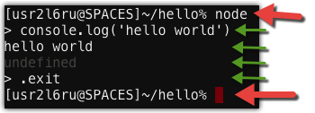

**Node.js Intro**

Made possible by: LITMIS, a [Krengeltech](https://krengeltech.com) brand.


On The Web: [litmis.com](http://litmis.com/)

Follow on Twitter: [@litmisteam](https://twitter.com/litmisteam)

Connect via email: [team@litmis.com](mailto:team@litmis.com)

Short URL: [bit.ly/litmislearn-nodejsintro](http://bit.ly/litmislearn-nodejsintro)

**Table Of Contents**

[[TOC]]

# Introduction

Welcome to the Node.js lab.  Node.js is defined as follows on nodejs.org:

*Node.js® is a JavaScript runtime built on Chrome's V8 JavaScript engine. Node.js uses an event-driven, non-blocking I/O model that makes it lightweight and efficient. Node.js' package ecosystem, npm, is the largest ecosystem of open source libraries in the world.*

Sounds exciting! But what does this mean?

This course will guide you through foundational concepts of Node.js.  

Node.js is built on Javascript.  This course is not meant to teach you Javascript, though there are some Javascript idiosyncrasies that are essential to understand in order to be a successful Node.js coder.  We will be covering those topics.

This course is both a lab and a reference.  It is a lab considering there is an end application that is to be built.  It’s also a reference that acknowledges the necessity to describe minute details which are foundationally necessary concepts.

## Conventions

* When you see a % sign that means you are at a shell prompt (aka PASE environment on IBM i)

* When you see> that means you are in the Node.js REPL (more on that later).

# Step 1: Litmis Space Configuration

This is a lab to meant to give you exposure on how Node.js works on the IBM i platform.  Labs are conducted on [Litmis Spaces Multi Tenant](http://litmis.com/spaces); a service from Krengeltech to provide preconfigured open source environments on IBM i cloud instances.  

**In short, everything can be done through the browser - no need to install big IDEs on your desktop.  Happy day!**

Go to [https://spaces.litmis.com](https://spaces.litmis.com) *(Ctrl+click to open new tab)* and select SIGN IN, as show below.


Select the authentication mechanism of your choice.  If you don't have an account with the options listed, sign up for a free Github.com profile and return back to this page once your Github profile is setup.


Once logged in you can create a new space, as shown below.


You will be presented with the below pop-up.  Give a name to this space, enter the promo code of **BETA**, **select the ****_Node.js_**** radio button**, and click the Create button.


Now you should see a new box on your page that represents your newly created Space.  


There are four buttons which constitute actions you can take with your Space.  They are (left to right):

* **Shell prompt.**  You will use this to enter commands in the PASE environment on the IBM i.   This is browser-based and doesn't require any software to be installed on your desktop.

* **Editor.**  Where you will edit your source code and navigate the IFS (Integrated File System).  This is browser-based and doesn't require any software to be installed on your desktop.

* **Space Information.**  Here you will find information about your space such as user profile, database schemas (aka libraries), ports for your web app to listen, Space id, etc.

* **Delete Space.**  **WARNING!** If you select this option and the subsequent warning prompt, your Space will be deleted.  This CANNOT be undone.

# Step 2: Check Node.js Installation

This next step requires opening the shell so we can type commands into PASE on IBM i.  Below is the button you need to press to open the shell (aka terminal).


Node.js has already been installed in your Litmis Space so we won't be going over those details here.  With that said it is necessary to verify the installation which can be done with the below command from the Shell (aka terminal).

```sh
% node -v
v6.9.1
```

As you can see we are running version 4.4.6 of Node.js which is the current version as of this writing.

# Step 3: Hello World

Sometimes the best way to learn something is to get a quick "win".  In an effort to not disrupt the balance of language introduction we’re going to create a hello world application.

First create a new directory to hold this new application, cd (change directory) into it, and touch app.js to create it.

```
% mkdir hello
% cd hello 
% touch app.js
```

Now go back to your Litmis Spaces page and click the editor button, as shown below.


This will open a new browser tab with the browser-based editor, as shown below.  **NOTE:** To see newly created files like hello/app.js you will need to right click on the root folder and select "Refresh".


Before we edit app.js we need to obtain some system information; specifically the port our web application will be listening to for inbound requests.  Go to your [Spaces page](https://spaces.litmis.com/workspaces) and select the information button to obtain the port that is dedicated to your user profile, as shown below.


Then in the pop-up window you should see the below section where the ports are delineated.


Now go to the browser-based editor and paste *(Ctrl+Shift+V) *the following into the newly created app.js file.  You may need to right click in the directory tree to refresh the list.  

**NOTE:** Make sure to change the below port of 60263 to the one obtained in the previous step. Also, make sure to save your source by using Ctrl+S or menu File->Save.

```js
var http = require('http')
var port = 60263

http.createServer(function(req, res) {
  res.writeHead(200, {'Content-Type': 'text/plain'})
  res.end('Hello World**\n**')
}).listen(port, '0.0.0.0')

console.log('Server running at http://0.0.0.0:%d', port)
```

Now go back to your console and enter the following command to start your application.

```sh
% node app.js 

Server running at http://0.0.0.0:60263
```

As you can see it output the value we placed in the call to console.log(...).  Now open a new tab in your browser and enter spaces.litmis.com:<your port>. You should see the below screenshot.


Wow!  That was simple!

For the fun of it let's add a log each time a request is made using the following line of code that is colored.

```js
var http = require('http')
var port = 60263
http.createServer(function(req, res) {
 res.writeHead(200, {'Content-Type': 'text/plain'})
 res.end('Hello World**\n**')
 console.log('Request came in at: ' + new Date())
}).listen(port, '0.0.0.0')

console.log('Server running at http://0.0.0.0:%d', port)
```

Now go back to your console and hit Ctrl+C to end the current application.  Then hit the up arrow to bring up the previous command and hit enter to run it again, as shown below.  Restarting the Node.js application is necessary so it can pick up the code changes.

```sh
% node app.js
Server running at http://0.0.0.0:60263
Request came in at: Mon Feb 22 2016 21:53:50 GMT+0000 (EST)
Request came in at: Mon Feb 22 2016 21:53:53 GMT+0000 (EST)
Request came in at: Mon Feb 22 2016 21:53:59 GMT+0000 (EST)
```

Refresh the hello world browser tab a few times and you should see additional log lines in the console with timestamps.

# Step 4: REPL Intro

Included with Node.js is the [REPL tool](https://nodejs.org/api/repl.html).  REPL stands for **R**ead, **E**val, **P**rint, and **L**oop and is a way to interactively run Javascript and see the results immediately.  I use the Node.js REPL on a regular basis to test small snippets of code.

To start a REPL you invoke the node command without any parameters, as shown below.  If your web application is still running from the previous hello world example, end it with Ctrl+C.



Once inside a REPL you can enter other Node.js (and Javascript) statements.  Shown above we use console.log(...) to write a message to the terminal.  The red arrows signify being in the PASE shell.  Green arrows signify being in the Node REPL.  Use .exit to return to the PASE shell.

Taking that example further, you can actually paste *(Ctrl+Shift+V) *the entire contents of the hello/app.js program into a Node.js REPL and it will execute all the code and run your web app, as shown below.


Now if you bring up your browser again you can see the same results as if you had run node app.js from the shell.  To end this Node.js REPL session select Ctrl+C twice.

There will be more examples of how to use the Node.js REPL later on.

# Step 5: Javascript, a quick intro

Node.js is a collection of Javascript APIs built on top of Google's V8 interpreter - the same Javascript engine that runs the Chrome web browser.  This effectively means Node.js *is* Javascript and all Node.js programs are *written in* Javascript.

Javascript has some phenomenal capabilities when it comes to running code concurrently.  With that said, I will not be teaching introductory Javascript** and instead focus on areas that aren't as obvious to a person coming from a traditional IBM i background (i.e. an RPG programmer, like me).

** You can learn intro to Javascript at [w3schools.com](http://www.w3schools.com/js/default.asp).

## Syntax

### Dynamic Types

Javascript has dynamic types.  This means a couple things.  First, you don't declare a datatype when you declare a variable.  Instead, a variable gets its data type when it is first assigned.  Not only that, but a Javascript variable can have its data type changed simply by placing a different value in it.  To test this concept paste the below code into a REPL session (type node in the shell and press the Enter key).

```js
var x

typeof x

x = 4

typeof x

x = "Harry"

typeof x

x = true

typeof x
```

The first line is declaring a variable of x.  Then the [typeof](https://developer.mozilla.org/en-US/docs/Web/JavaScript/Reference/Operators/typeof) operator conveys the current data type of the variable.  The subsequent lines are all setting the variable to a different data type and then using typeof to display the change.

You should see results in your console similar to the following after pasting into the REPL.

```sh
% node
> var x
undefined
> typeof x
'undefined'
> x = 4
4
> typeof x
'number'
> x = "Harry"
'Harry'
> typeof x
'string'
> x = true
true
> typeof x
'boolean'
```

Notice there aren't errors when assigning various different data types to the same variable?  The x variable has its data type changed when a new type of data is assigned to it.

**NOTE:** Semicolons are optional in Javascript, although there's a catch with that.  Depending on the Javascript runtime processing the code you may get different results.  It is for that reason most people include semicolons on all of their code even when they control the runtime (which you can only really control the runtime on the server-side).

# Step 6: Modular Code

Node.js has a simple mechanism for modularizing code: [Modules](https://nodejs.org/api/modules.html).  To learn about modules, first create a file named funcs.js in the hello directory and occupy it with the below contents. 

function func1(p1, p2){

  return p1 + p2

}

exports.func1 = func1

The first three lines in funcs.js declare a function named func1. Functions are similar to sub procedures in RPG.  The fourth line is exporting func1.  To accomplish the same in RPG we place the EXPORT keyword on the P-spec of a sub procedure definition.  Next create file funcstest.js so we can test our newly created module, as shown below.

```js 
var f = require('./funcs')
var result = f.func1(2, 3)
console.log('result:' + result)
```

Now go back to your shell and run funcstest.js, as shown below.

```sh
% node funcstest.js
result:5
```

Javascript functions have many more features but this at least gives you an idea of how the require() capabilities work.

# Step 7: npm, The Package Manager

Node.js has what's called a "package manager." Wikipedia.org gives the following definition to package managers:

*A package manager or package management system is a collection of software tools that automates the process of installing, upgrading, configuring, and removing software packages for a computer’s operating system in a consistent manner. It typically maintains a database of software dependencies and version information to prevent software mismatches and missing prerequisites.*

Package managers aren’t a new concept, though I believe they’re getting incrementally better. Such is the case with the Node.js Package Manager, npm for short. The npm tool makes it easy for JavaScript developers to share, reuse and maintain code. Publicly available npms are hosted on [npmjs.com](https://www.npmjs.com/). Here you’ll find a vast repository where many thousands of Node.js packages reside. The best part is it’s free to the community—(one of the reasons Node.js has taken off so well). 

Now let's test npm to see how it works.  First change to your home directory and create a new directory named app1 and cd into it, as shown below.  Note the tilde (~) is a shortcut to the home directory.  Note the two amersands (&&) are a way to combine two commands on a single line.

```sh
% cd ~/
% mkdir app1 && cd app1
```

Now run npm init to create what's called the package.json file which will hold information about the application like the author, a description, and dependencies.  You will be prompted for many values, as shown below.  Provide input or hit the Enter key to accept the default.

```sh
% npm init
This utility will walk you through creating a package.json file.
It only covers the most common items, and tries to guess sensible defaults.
See `npm help json` for definitive documentation on these fields
and exactly what they do.
Use `npm install <pkg> --save` afterwards to install a package and

save it as a dependency in the package.json file.

Press ^C at any time to quit.

name: (app1) 

version: (1.0.0) 

description: My first Node.js app

entry point: (index.js) 

test command: 

git repository: 

keywords: 

author: 

license: (ISC) 

About to write to /home/USR2L6RU/app1/package.json:

{

  "name": "app1",

  "version": "1.0.0",

  "description": "My first Node.js app",

  "main": "index.js",

  "scripts": {

    "test": "echo \"Error: no test specified\" && exit 1"

  },

  "author": "",

  "license": "ISC"

}

Is this ok? (yes) 
```

You now have a file named packages.json and can view it using the cat command, as shown below.

```sh
% cat package.json 
{
  "name": "app1",
  "version": "1.0.0",
  "description": "My first Node.js app",
  "main": "index.js",
  "scripts": {
    "test": "echo \"Error: no test specified\" && exit 1"
  },
  "author": "",
  "license": "ISC"
}
```

Next we will install one of the most popular Node.js modules - a web framework named [Express](http://expressjs.com/) which will be used to build a web app.  The --save option tells npm to add express as a dependency in package.json.

```sh
% npm install express --save
express@4.13.4 node_modules/express
├── array-flatten@1.1.1
├── escape-html@1.0.3
├── utils-merge@1.0.0
├── merge-descriptors@1.0.1
├── methods@1.1.2
├── cookie-signature@1.0.6
├── fresh@0.3.0
├── range-parser@1.0.3
├── vary@1.0.1
├── path-to-regexp@0.1.7
├── parseurl@1.3.1
├── cookie@0.1.5
├── etag@1.7.0
├── content-type@1.0.1
├── content-disposition@0.5.1
├── serve-static@1.10.2
├── depd@1.1.0
├── on-finished@2.3.0 (ee-first@1.1.1)
├── finalhandler@0.4.1 (unpipe@1.0.0)
├── qs@4.0.0
├── debug@2.2.0 (ms@0.7.1)
├── proxy-addr@1.0.10 (forwarded@0.1.0, ipaddr.js@1.0.5)
├── send@0.13.1 (destroy@1.0.4, statuses@1.2.1, ms@0.7.1, mime@1.3.4, http-errors@1.3.1)
├── accepts@1.2.13 (negotiator@0.5.3, mime-types@2.1.10)
└── type-is@1.6.12 (media-typer@0.3.0, mime-types@2.1.10)
```

After installing the express module you should see a log, as shown above.  When npm downloads express it looks at its package.json file to learn what other dependencies need to be downloaded and also obtains them.  This is a recursive process until the bottom of the dependency list is reached.  All the downloaded modules are stored in the node_modules/ folder of your current directory.

Now create a new file named index.js in directory app1 and paste the following content into it so we can see Express in action.

```js
var express = require('express')
var app = express()

app.get('/', function(req, res) {
  res.send('Hello World!');
})

var port = process.env.PORT || 60263
app.listen(port, function() {
  console.log('Running on port %d', port)
})
```

This is another hello world example using Express instead of going direct to the base Node.js capabilities.  The first line is bringing in the express module.  Notice there isn't a relative path specified.  You can omit the path because the express module is located in the node_modules/ directory, which is part of the search path when loading modules.

Line 2 is obtaining a reference to the Express application object which is subsequently used on line 4 to listen for the "root route".  A "route" is a path from the browser to code in your Node.js application.  In this case we have a single route (i.e. '/') defined so when we bring up the root of the website it will display "Hello World!".  

On line 8 we occupy the port variable.  The double vertical pipe syntax (||) is the *or* operator which will first check whether process.env.PORT has a value.  If not, it will occupy it with the value to the right of the vertical pipes (i.e. 60263).  The process.env object gives us access to environment variables from the current process (aka IBM i job).  What this means is an overriding port can be passed when starting the application, as shown below.  Go ahead and try running your app on the various ports dedicated to your profile.  **Reminder:** Your ports are located in the Space information pop-up (the 'i' button).

```sh
% PORT=60263 node index.js
Running on port 60263
```

Notice how PORT=60263 is specified *before* the node index.js portion.  This is valid syntax and is basically setting the PORT environment variable for only the duration of this particular call to the node binary.  If you wanted to have the PORT environment variable to be set at the process (aka IBM i job) level then you'd use export PORT=602604.


Go ahead and open a browser window to see your Express hello world app running, as shown below.


Going back to the index.js code, lines 4 and 9 have what's called an "**inline anonymous function"**.  These are *all over the place* in Node.js.  An understanding of them is essential to adequately write applications in Node.js.  Before going further it would be good to learn more about Javascript functions.

# Step 8: Functions

At a high level [Javascript functions](http://www.w3schools.com/js/js_function_definition.asp) are synonymous with RPG subprocedures.  Below is a function named func1 that receives in two parameters, adds them together, and returns the result.

```js
function func1(p1, p2) {
  return p1 + p2
}

var total = func1(2, 3)
console.log(total)
```

Paste *(Ctrl+Shift+V)* the above code into the REPL to see it run.  After func1 is declared we see it being invoked and display the total variable via console.log(...).  Exit the Node.js REPL by typing .exit

Start the Node.js REPL again and paste *(Ctrl+Shift+V) *the below code into it.  Notice the func1() function is being invoked *before* it is declared.

```js
var total = func1(2, 3)
console.log(total)

function func1(p1, p2) {
  return p1 + p2
}
```

You should end up with an error like the following that declares the function was not found.  This is because of how Javascript is parsed - top down - and a function must be defined before it can be used.

```
ReferenceError: func1 is not defined
    at repl:1:13
    at REPLServer.defaultEval (repl.js:132:27)
    at bound (domain.js:284:14)
    at REPLServer.runBound [as eval] (domain.js:297:12)
    at REPLServer.<anonymous> (repl.js:279:12)
    at REPLServer.emit (events.js:107:17)
    at REPLServer.Interface._onLine (readline.js:214:10)
    at REPLServer.Interface._line (readline.js:553:8)
    at REPLServer.Interface._ttyWrite (readline.js:830:14)
    at ReadStream.onkeypress (readline.js:109:10)
```

The above is one way to define a function, but there are many more.  Let's go back to the Express hello world program, shown below.

```js
app.get('/', function(req, res) {
  res.send('Hello World!')
})
```

Notice the second parameter on the call to apt.get(...).  This is an **inline anonymous function**, literally a chunk of code being passed as a parameter.  The function could also have been separately declared and then reference the name on the call to app.get(...), as shown below.

```js
function process_get(req, res) {
  res.send('Hello World!')
}

app.get('/', process_get)
```

What's the difference?  

For the most part they are functionally the same.  What's significant is the concept behind it.  When a request is made to the root of the website, the function specified on `app.get(...)` will be invoked, eventually.  What do I mean by "eventually"?  Well, first the code within `app.get(...)` will run a bunch of other code, including parsing the query string or reading in HTML form variables, *before* it invokes the function passed as the second parameter.  This is the "call back" concept, where a called function will "call back" into a function that was passed to it.  Many times the callback will have parameters defined on it to receive input, in this case the req and res variables.  RPG has a similar concept with [procedure pointers](http://www.ibm.com/developerworks/ibmi/library/i-rpg-pointers/).

Now it's time to take the hello world app to new heights by introducing a connection to DB2.

# Step 9: Connecting to DB2

Connecting to DB2 from Node.js is very straight forward.  We don't need to run npm install because IBM delivers a [DB2 adapter/driver](http://bit.ly/nodejs_db2foriaccess) with Node.js.  The DB2 adapter/driver doesn't actually exist on npmjs.com so it couldn't be installed in that fashion anyway.

Before we modify the Node.js web application we need to create a DB2 table in the schema (aka library) reserved to your profile.  Your DB2 schema can be found on the same info screen as the port from earlier in this tutorial.  **Replace xxxxx_D with your library name.**

Paste the below contents into a new file named sql.js and then run it with node sql.js.

```js
const db = require('/QOpenSys/QIBM/ProdData/OPS/Node6/os400/db2i/lib/db2a')
 
const dbconn = new db.dbconn()
dbconn.conn("*LOCAL")
const stmt = new db.dbstmt(dbconn)
const schema = 'xxxxx_D'
let sql =
`CREATE TABLE ${schema}.CUSTOMER ( \
CUSNUM NUMERIC(6, 0),            \
LSTNAM VARCHAR(50),              \
INIT CHAR(1),                    \
STREET VARCHAR(100),             \
CITY VARCHAR(100),               \
STATE CHAR(2),                   \
ZIPCOD NUMERIC(5, 0)             \
)`
stmt.exec(sql, **function**(result, err){
  console.log('error:' + err)
  console.log('result:' + result)
  sql = `INSERT INTO ${schema}.CUSTOMER VALUES (123,'Smith','L','123 Center','Mankato','MN',56001)`
  stmt.exec(sql, **function**(result,err){
    console.log('error:' + err)
    console.log('result:' + result)
    sql = `select * from ${schema}.systables WHERE TABLE_TYPE='T'`
    stmt.exec(sql, **function**(result,err) {
      console.log('error:' + err)
      console.log('result:' + JSON.stringify(result))
    })
  })
})
```

The first line is a fully qualified path to where the db2a.js file lives in the IFS.  Note you can omit the `.js` extension because `require(...)` will assume that extension.  The `db.conn("*LOCAL")` will connect to the local database and use the profile this script is running under for authorization.  You could also specify a different profile and password.

The `stmt.exec(...)` lines are where the action happens.  You'll notice the stmt.exec functions are inside of one another.  This is because we need to make sure the next SQL statement doesn't start before the current one completes. If this seems odd then you are in good company because it is very different than how other programming languages work. With this you can see how Javascript's asynchronous processing is a first class citizen.  More on that later.

The third query of systables is performed so we can learn whether the `CREATE TABLE` was successful.  You should see output similar to the following.  Note I have formatted the below output so it is easier to decipher. 


```
[ { TABLE_NAME: 'CUSTOMER',
    TABLE_OWNER: 'USRxxxxx',
    TABLE_TYPE: 'T',
    COLUMN_COUNT: '7',
    ROW_LENGTH: '43',
    TABLE_TEXT: '',
    LONG_COMMENT: '',
    TABLE_SCHEMA: 'xxxxx_D',
    LAST_ALTERED_TIMESTAMP: '2016-03-02-17.09.23.654000',
    SYSTEM_TABLE_NAME: 'CUSTOMER  ',
    SYSTEM_TABLE_SCHEMA: 'xxxxx_D   ',
    FILE_TYPE: 'D',
    BASE_TABLE_CATALOG: '',
    BASE_TABLE_SCHEMA: '',
    BASE_TABLE_NAME: '',
    BASE_TABLE_MEMBER: '',
    SYSTEM_TABLE: 'N',
    SELECT_OMIT: 'N',
    IS_INSERTABLE_INTO: 'YES',
    IASP_NUMBER: '0',
    ENABLED: '',
    MAINTENANCE: '',
    REFRESH: '',
    REFRESH_TIME: '0001-01-01-00.00.00.000000',
    MQT_DEFINITION: '@@@@@@@@@@@@@@@@@@@@@@@@@@',
    ISOLATION: '  ',
    PARTITION_TABLE: 'NO',
    TABLE_DEFINER: 'USRxxxxx',
    MQT_RESTORE_DEFERRED: ' ',
    ROUNDING_MODE: ' ',
    CONTROL: ' ' } ]
```

Next we need to modify our web app to use the new CUSTOMER table.  Below is the modified index.js program.  The colored lines convey what has been added.  

```js
const db = require('/QOpenSys/QIBM/ProdData/OPS/Node6/os400/db2i/lib/db2a')
const dbconn = new db.dbconn()
dbconn.conn("*LOCAL")
const stmt = new db.dbstmt(dbconn)
const schema = 'xxxxx_D'

var express = require('express')
var app = express()

app.get('/', function(req, res) {
  stmt.exec(`SELECT * FROM ${schema}.CUSTOMER`, **function**(results, err) {
   res.json(results)
  })
})

var port = process.env.PORT || 60263
app.listen(port, function() {
  console.log('Running on port %d', port)
})
```

The database changes have already been covered but you'll also note that instead of res.send(...) we are using res.json(...). This will change the Content-type header that's sent back down to the client, among other things.  I did this to introduce you to another way to send a response.

Make the previous changes to your index.js file and then start your application again, as shown below.

```sh
% node index.js 
Running on port 60263
```

Open your browser and you should see something similar to the below screenshot.


**Victory! Your Node.js is connecting to the database.**

# Step 10: The View Layer

Next, we want to further develop the application by implementing a template engine to simplify the creation of dynamic HTML pages. We’ll use the [pug](https://www.npmjs.com/package/pug) template engine due to its popularity and flexibility. To install pug, we will again go to the npm install command.  This time we’ll add a --save option at the end to declare we’d like this retained in the package.json file.

```sh
% npm install pug --save
app1@1.0.0 /home/USRxxxxx/app1                                                  
`-- pug@2.0.0-beta11
  +-- pug-code-gen@1.1.1
  | +-- constantinople@3.1.0
  | | +-- acorn@3.3.0                                                           
  | | `-- is-expression@2.1.0                                                   
  | +-- doctypes@1.1.0                                                          
  | +-- js-stringify@1.0.2                                                      
  | +-- pug-attrs@2.0.2                                                         
  | +-- pug-error@1.3.2                                                         
  | +-- void-elements@2.0.1                                                     
  | `-- with@5.1.1                                                              
  |   `-- acorn-globals@3.1.0                                                   
  |     `-- acorn@4.0.11                                                        
  +-- pug-filters@2.1.1                                                         
  | +-- clean-css@3.4.24                                                        
  | | +-- commander@2.8.1                                                       
  | | | `-- graceful-readlink@1.0.1                                             
  | | `-- source-map@0.4.4                                                      
  | |   `-- amdefine@1.0.1                                                      
  | +-- jstransformer@1.0.0                                                     
  | | +-- is-promise@2.1.0                                                      
  | | `-- promise@7.1.1                                                         
  | |   `-- asap@2.0.5                                                          
  | +-- pug-walk@1.1.1                                                          
  | +-- resolve@1.2.0                                                           
  | `-- uglify-js@2.7.5                                                         
  |   +-- async@0.2.10                                                          
  |   +-- source-map@0.5.6                                                      
  |   +-- uglify-to-browserify@1.0.2                                            
  |   `-- yargs@3.10.0                                                          
  |     +-- camelcase@1.2.1                                                     
  |     +-- cliui@2.1.0                                                         
  |     | +-- center-align@0.1.3  
  |     | | +-- align-text@0.1.4                                                
  |     | | | +-- kind-of@3.1.0                                                 
  |     | | | | `-- is-buffer@1.1.4                                             
  |     | | | +-- longest@1.0.1                                               
  |     | | | `-- repeat-string@1.6.1                                           
  |     | | `-- lazy-cache@1.0.4                                                
  |     | +-- right-align@0.1.3                                                 
  |     | `-- wordwrap@0.0.2                                                    
  |     +-- decamelize@1.2.0                                                    
  |     `-- window-size@0.1.0                                                   
  +-- pug-lexer@3.0.0                                                           
  | +-- character-parser@2.2.0                                                  
  | | `-- is-regex@1.0.4                                                        
  | |   `-- has@1.0.1                                                           
  | |     `-- function-bind@1.1.0                                               
  | `-- is-expression@3.0.0                                                     
  |   `-- acorn@4.0.11                                                          
  +-- pug-linker@2.0.2                                                          
  +-- pug-load@2.0.5                                                            
  | `-- object-assign@4.1.1                                                     
  +-- pug-parser@2.0.2                                                          
  | `-- token-stream@0.0.1                                                     
  +-- pug-runtime@2.0.3                                                         
  `-- pug-strip-comments@1.0.2
```

Using the cat command we can see the modified package.json file with reference to the Jade module.

```sh
% cat package.json 
{
  "name": "app1",
  "version": "1.0.0",
  "description": "My first Node.js app",
  "main": "index.js",
  "scripts": {
    "test": "echo \"Error: no test specified\" && exit 1"
  },
  "author": "",
  "license": "ISC",
  "dependencies": {
    "express": "^4.13.4",
    "pug": "^2.0.0-beta11"
  }
}
```

Next, we need to create a folder to hold our new template engine files so we can keep them separate and organized from the rest of the application. Run the following mkdir command to create a directory named views.

```sh
% mkdir views
```

**NOTE:** In the browser-based code editor you can right click on the root folder and select "Refresh" to see any files or folders you've created from the shell.

Within the views directory, create a file named index.jade and populate it with the following text, making sure to retain the leading spaces. 

```html
html
  head
    title!= title
  body
    h1!= message
```

What you see is Pug syntax that aims to make HTML composition significantly less "noisy" (i.e., more whitespace). Indentation in Pug allows us to declare when closing tags should be assumptively inserted. For example, the head tag will close when the body tag is encountered because they’re at the same indentation depth (two spaces).

When you see an equal sign (=), or exclamation plus equal sign (!=), it means the content on the right is a variable made available to the view from the controller. There are many more aspects you can learn about in the [Pug reference](https://pugjs.org/api/reference.html).

Below are the necessary Pug additions for views to work in index.js. First, we use app.set(...) to declare the directory where views are stored and then set the view engine to 'pug'. Once the view engine is set, we can alter the contents of app.get(...) to invoke res.render(), passing the name of the view (index) and set named variables we want to pass to the view—namely title and message.

```js
const db = require('/QOpenSys/QIBM/ProdData/OPS/Node6/os400/db2i/lib/db2a')

const dbconn = new db.dbconn()
dbconn.conn("*LOCAL")
const stmt = new db.dbstmt(dbconn)
const schema = 'ED0ZS_D'
 
var express = require('express')
var app = express()
 
app.set('views', __dirname + '/views')
app.set('view engine', 'pug')

app.get('/', function(req, res) {
 res.render('index', { title: 'Hey', message: 'Hey Jade!'})
})

app.get('/', function(req, res) {
  stmt.exec(`SELECT * FROM ${schema}.CUSTOMER`, **function**(results, err) {
   res.json(results)
  })
})


var port = process.env.PORT || 62453
app.listen(port, function() {
  console.log('Running on port %d', port)
})
```

At this point we’re ready to start the application with the following command. If your application is still running from last time, you’ll need to first end it (i.e., Ctrl + C) to pick up the latest changes in index.js.

```sh
% node index.js
```

Below is a screenshot of what you should now be seeing.


Now that we know how to pass variables to the view layer, let’s make it a bit more dynamic by retrieving database rows to display a list of customers from table CUSTOMER that was created earlier. To accomplish this, we’re first going to create a new file named customers.pug in the views directory and populate it with the following content.

```js
h1=title
  table
    thead
      tr
        th Last Name
        th Customer Number
    tbody
      each row in results
        tr
          td=row.LSTNAM
          td=row.CUSNUM

```

Here we learn about Pug’s ability to iterate over a result set using the each keyword. The results variable was provided by the controller (index.js) and the row variable is occupied with an SQL row at each iteration. LSTNAM and CUSNUM are columns from DB2 table CUSTOMER.

Next, we need to make changes to index.js that query DB2 to provide the results variable to the customers.pug view, as shown. Note, only changes and additions are being shown in color.

```js
app.get('/customers', function(req, res) {
  db.exec("SELECT LSTNAM, CUSNUM FROM xxxxx_D.CUSTOMER", **function**(results) {
    res.render('customers', { title: 'Customers', results: results})
  })
})
```

The first parameter of res.render(...) is declaring what view, minus the extension of .pug, to render.  The second parameter is a Javascript object (curly brackets) with variables that will be passed to the UI layer.  Restart your application (Ctrl + C, then node index.js) and you should see the following in your browser.  

**NOTE:** There is now /customers at the end of the URL.


Next, let’s introduce a feature of displaying more information about a customer when it’s clicked. We can do that by modifying the td tag holding the CUSNUM value to have a dynamically generated link to that specific customer, as shown. The ${...} syntax is [string interpolation](http://jade-lang.com/reference/interpolation/) and makes referencing variables in strings significantly easier. Also note the indentation needs to be correct number of spaces.

```js
h1=title
 table
   thead
     tr
       th Last Name
       th Customer Number
   tbody
     - each row in results
       tr
         td=row.LSTNAM
         td: a(href=`/customer/${row.CUSNUM}`)=row.CUSNUM
```

Now we need to add code to index.js to process requests for specific customers, as shown below.  Add this code towards the bottom immediately before we assign the port variable.

```js
app.get('/customer/:id', function(req, res) {
  var sql = `SELECT * FROM ${schema}.CUSTOMER WHERE CUSNUM=` + req.params.id
  stmt.exec(sql, **function**(result, err) {
    res.render('customer', { title: 'Customer', result: result[0]})
  })
})
```

Note the :id reference in the first parameter of app.get(...). This says that whatever is specified on the URL after /customer/ should be placed into a variable named id within the req.params object. We can then access it with the syntax req.params.id and concatenate it into the SQL statement.  After stmt.exec() is run we get the result *array* object. Then we use result[0] to set the result view variable to the first element in the array.

NOTE: This SQL statement is open to injection attacks.  Read more [here](https://en.wikipedia.org/wiki/SQL_injection) if you'd like.

Restarting your application and navigating to /customers should reveal the results shown below.  Notice how the customer number is now a link.


Next, create a customer.pug file in the views directory to facilitate the previous res.render('customer', ...), as shown below. Note that this view was singular and the other one was plural (customer.pug vs. customers.pug) as that’s a common convention.

```js
h1=title
table
  tr
    td: b Customer Number
    td=result.CUSNUM
  tr
    td: b Last Name
    td=result.LSTNAM
  tr
    td: b Initial
    td=result.INIT
  tr
    td: b Street
    td=result.STREET
  tr
    td: b City State, Zip
    td= result.CITY + " " + result.STATE + ", " + result.ZIPCOD
a(href='/customers') Back
```

Restart the application, go to the /customers page and click on a customer. You should see a page similar to the below.


# Step 11: Creating CRUD

Now it's time to make this application have full CRUD (**C**reate, **R**ead, **U**pdate, **D**elete) capabilities. 

In the previous section we created a views directory and placed index.pug (home page), customers.pug (customer listing) and customer.pug (show a single customer) in it. To better organize for application growth, we will create directory views/customers and rename customers.pug to index.pug and customer.pug to show.pug, and put them both in this new directory.  I've laid out the commands necessary to accomplish this task below.

**NOTE:** The pwd command prints your working directory so you know where you are in the file system.

```sh
% pwd
/home/USRxxxxx/app1
% mkdir views/customers
% mv views/customers.pug views/customers/index.pug
% mv views/customer.pug views/customers/show.pug
```

Since we’re adding create and update capabilities to the application, we need to compose some new view files, specifically views/customers/new.pug and views/customers/edit.pug.

Below is the content for new.pug.

```js
h1 New Customer
include _form
a(href='/customers') Back
```

Below is the content for edit.pug.

```js
h1 Edit Customer
include _form
a(href='/customers') Back
```

Notice the include _form portion. This is bringing in what's called a "partial" named _form.pug, which also needs to exist in the views/customers directory.  Partials are similar to doing a /COPY in RPG to bring in an external sub routine or procedure.  Create the file views/customers/_form.pug and occupy it with the below content.


```js
form(method="post",action=form_action)
  p CUSNUM: 
    input(type="number", name="CUSNUM", value=result.CUSNUM)
  p LSTNAM:
    input(type="text", name="LSTNAM", value=result.LSTNAM)
  p INIT: 
    input(type="text", name="INIT", value=result.INIT)
  p STREET: 
    input(type="text", name="STREET", value=result.STREET)
  p
    button(type="submit") submit
```

When specifying include you don't need to specify the .pug extension. Also, view files prefixed with underscores denote they are partials. This partial will be used for both new and edit scenarios, which is why we modularized it into a partial. More on this later when we get to the controller code in index.js.

The last view layer change is to views/customers/index.pug, as shown below with the lines that are black.

```js
a(href='/customers/new') New Customer 
h1=title
  table
    thead
      tr
        th Last Name
        th Customer Number
        th
        th
    tbody
      - each row in results
        tr
          td=row.LSTNAM
          td: a(href=`/customers/${row.CUSNUM}`)=row.CUSNUM  
          td: a(href=`/customers/${row.CUSNUM}/edit`) edit
          td: a(href=`/customers/${row.CUSNUM}/delete`) delete
```

Links to "New Customer," "edit", and "delete" have been added. Notice how the "New Customer" link doesn't have reference to a particular customer and "edit"/"delete" does (i.e., row.CUSNUM). By specifying row.CUSNUM we turn the URL into something similar to an RPG CHAIN, allowing the index.js controller code to know which row in the database should be acted upon.

Below is the entirety of the index.js file that has the changes/additions in color.  Make sure to replace xxxxx_D with your schema name.  Next we will dive into the changes.

```js
var db = require('/QOpenSys/QIBM/ProdData/OPS/Node6/os400/db2i/lib/db2a')
var util = require( "util" )
var body_parser = require('body-parser')
var express = require('express')
var app = express()
 
db.init()
db.conn('*LOCAL', **function**(){
  db.autoCommit(true)
})

db.exec("SET SCHEMA xxxxx_D")

app.set('views', __dirname + '/views')
app.set('view engine', 'jade')

app.use(body_parser.urlencoded({ extended: true }))

app.get('/', function(req, res) {
 res.render('index', { title: 'Hey', message: 'Hey Jade!'})
})
 
app.get('/customers', function(req, res) {
 db.exec("SELECT LSTNAM, CUSNUM FROM CUSTOMER", **function**(results) {
    res.render('customers/index', { title: 'Customers', results: results})
  })
})

app.get('/customers/new', function(req, res) {
  res.render('customers/new', {result: {}, form_action: '/customers/create'})
})

app.post('/customers/create', function(req, res) {
  var sql = util.format(
    "INSERT INTO CUSTOMER (CUSNUM,LSTNAM,INIT,STREET) VALUES ('%s', '%s', '%s', '%s')",
    req.body.CUSNUM, req.body.LSTNAM, req.body.INIT, req.body.STREET
  )
  db.exec(sql)
  res.redirect('/customers')
})

app.get('/customer/:id', function(req, res) {
 var sql = "SELECT * FROM CUSTOMER WHERE CUSNUM=" + req.params.id
 db.exec(sql, **function**(result) {
   res.render('customers/show', { title: 'Customer', result: result[0]})
 })
})

app.get('/customers/:id/edit', function(req, res) {
  var sql = util.format("SELECT * FROM CUSTOMER WHERE CUSNUM=%s", req.params.id)
  db.exec(sql, **function**(result) {
    res.render('customers/edit',
      { title: 'Customer',
        result: result[0],
        form_action: util.format('/customers/%s/update', req.params.id)
      }
    )
  })
})

app.post('/customers/:id/update', function(req, res) {
  var sql = util.format(
    "UPDATE CUSTOMER SET CUSNUM='%s',LSTNAM='%s',INIT='%s',STREET='%s' WHERE CUSNUM='%s'",
    req.body.CUSNUM, req.body.LSTNAM, req.body.INIT, req.body.STREET, req.body.CUSNUM
  )
  db.exec(sql)
  res.redirect('/customers')
})

app.get('/customers/:id/delete', function(req, res) {
  var sql = util.format("DELETE FROM CUSTOMER WHERE CUSNUM='%s'", req.params.id)
  db.exec(sql)
  res.redirect('/customers')
})

var port = process.env.PORT || 60263
app.listen(port, function() {
  console.log('Running on port %d', port)
})
```

Now let's wade through the index.js changes that turn the original display-only application into a CRUD application.  The first change is a new ExpressJs middleware named body-parser, as shown below.

```js
var body_parser = require('body-parser')

. . .

app.use(body_parser.urlencoded({ extended: true }))
```

This module will take HTML form variables and place them in req.body so we can easily access form variables (i.e., req.body.CUSNUM).  Use the following command to install body-parser. The --save option saves it into package.json.

```sh 
% npm install body-parser --save
```

I’ve also introduced the util module. The util.format(...) function greatly cleans up string replacement in SQL statements, as shown below.

```js
var util = require('util')

. . .

var sql = util.format(
 "INSERT INTO CUSTOMER (CUSNUM,LSTNAM,INIT,STREET) VALUES ('%s', '%s', '%s', '%s')",
 req.body.CUSNUM, req.body.LSTNAM, req.body.INIT, req.body.STREET
)
```

In the database initialization portion, I set autoCommit to true and set the schema so we didn't have to fully qualify on each SQL statement.

```js
db.conn('*LOCAL', **function**(){
  db.autoCommit(true)
})

db.exec("SET SCHEMA xxxxx_D")
```

Setting the schema globally works in this application because we’re accessing a single schema. If multiple schemas were being accessed, then qualified tables would be a better approach.

Let’s dive into how the various routes have changed. When displaying data (i.e., index.jade and show.jade) you only need one route to accomplish each task. When multiple user interactions are required (i.e., display a form and then process it), then you need multiple routes to make that flow work. For example, consider the /customers/:id/edit and /customers/:id/update routes below. The /edit route is used to first load an existing DB2 entry into a form and the /update route is to process the HTML form submission. Notice how the res.render in the /edit route is setting the form_action view variable. This is how the /edit and /new routes can share the same HTML form, namely the _form.jade file.

The /update route receives in the form submission, composes and executes an SQL UPDATE statement, and then redirects the user back to the /customers route.

```js
app.get('/customers/:id/edit', function(req, res) {
 var sql = util.format("SELECT * FROM CUSTOMER WHERE CUSNUM=%s", req.params.id)
 db.exec(sql, **function**(result) {
   res.render('customers/edit',
     { title: 'Customer',
       result: result[0],
       form_action: util.format('/customers/%s/update', req.params.id)
     })
 })
})

app.post('/customers/:id/update', function(req, res) {
 var sql = util.format(
   "UPDATE CUSTOMER SET CUSNUM='%s',LSTNAM='%s',INIT='%s',STREET='%s' WHERE CUSNUM='%s'",
   req.body.CUSNUM, req.body.LSTNAM, req.body.INIT, req.body.STREET, req.body.CUSNUM
 )
 db.exec(sql)
 res.redirect('/customers')
})
```

Below are the /customers/new and /customers/create routes that are used to display an empty form and process that form’s submission, respectively. This is very similar to the /edit and /update routes previously described, including the setting of the form_action view variable to alter the path that the form will be submitted to.

```js
app.get('/customers/new', function(req, res) {
  res.render('customers/new', {result: {}, form_action: '/customers/create'})
})
 
app.post('/customers/create', function(req, res) {
  var sql = util.format(
    "INSERT INTO CUSTOMER (CUSNUM,LSTNAM,INIT,STREET) VALUES ('%s', '%s', '%s', '%s')",
    req.body.CUSNUM, req.body.LSTNAM, req.body.INIT, req.body.STREET
  )
  db.exec(sql)
  res.redirect('/customers')
})
```

And finally, see the /customers/:id/delete route for DB2 row removal. I could have been more purist and used app.delete for the route.  However, that requires more complexity in the view layer and an app.get with an :id accomplishes the task quite nicely.

```
app.get('/customers/:id/delete', function(req, res) {
  var sql = util.format("DELETE FROM CUSTOMER WHERE CUSNUM='%s'", req.params.id)
  db.exec(sql)
  res.redirect('/customers')
})
```

Below is a screenshot of the new customer listing.


Below is the **New Customer** page.


Below is the **Edit Customer** page.


# Step 12: Websockets

Now it's time to use HTML5's WebSockets.

I often find myself wishing things were simpler with web development, specifically the link between the browser and server.  I don't want to think as much about the underlying technology.  I’d rather focus more on meeting the overall business need. Many technologies have improved in this area over the years using concepts of convention over configuration (thank you, Ruby on Rails). Today, I am tooting the horn of JavaScript and Node.js in the implementation of HTML5 WebSockets.

Wikipedia describes HTML5 WebSockets as *"a protocol providing full-duplex communication channels over a single TCP connection"*.

HTML5 is just a specification, not an implementation. It's every technology stack's responsibility to implement said spec - not only to make everything adhere to the spec but also to put some amount of focus on making usage easy for the web developer. In the case of Node.js, we have a Node Package Module (NPM) named **socket.io** that implements HTML5 WebSockets with excellence to the point of being surprisingly simple and easy to use.

Our next goal is to use socket.io to create a chat application using HTML5 WebSockets, as shown in the below screenshot. 


The concept is that two browser clients will obtain a WebSocket connection to the server.  Chat messages entered in one browser are delivered from the server to the client in another browser, without the client polling the server. It is important to note the lack of polling in that last sentence. That’s how things were done in the past. Now, the server can initiate communication down to the client. Very cool!

This application will be created in a new directory.  We’ll install everything from scratch.  Please run the following commands from your shell console.

```sh
% cd ~
% mkdir websock
% cd websock
% npm init
% npm install express --save
% npm install socket.io --save
% touch index.js index.html
```

The above will create a new directory, websock, install the Express and Socket.io modules, and create the only two files this application requires; index.js and index.html.  Paste the below HTML document into index.html.

```html
<!doctype html>

<html>
  <head>
    <style>
  * { margin: 0; padding: 0; box-sizing: border-box; }
    body { font: 13px Helvetica, Arial; }
    form { background: #000; padding: 3px; position: fixed; bottom: 0; width: 100%; }
    form input { border: 0; padding: 10px; width: 90%; margin-right: .5%; }
    form button { width: 9%; background: rgb(130, 224, 255); border: none; padding: 10px; }
    #messages { **list-style-type**: none; margin: 0; padding: 0; }
    #messages li { padding: 5px 10px; }
    #messages li:nth-child(odd) { background: #eee; }
    </style>
  </head>
  <body>
    <ul id="messages"></ul>
    <form action="">
      <input id="m" autocomplete="off" /><button>Send</button>
    </form>
    <script src="https://cdn.socket.io/socket.io-1.4.5.js"></script>
    <script src="https://code.jquery.com/jquery-2.2.1.min.js"></script>
    <script>
    var client = io();
    $('form').submit(function(){
      client.emit('chat_msg', $('#m').val());
      $('#m').val('');
      return false;
    });
    client.on('chat_msg', **function**(msg){
      $('#messages').append($('<li>').text(msg));
    });
    </script>
  </body>
</html>
```

The above is a typical HTML document.  There is CSS at the top in the `<style>` tag, HTML in the `<body>` area, and some Javascript to make things more aesthetically palatable (specifically the user experience).  Concerning the HTML in the `<body>` tag, take note of the `<ul>` entity with an id of messages.  This is where the chat log will reside.  Then there is a single `<input>` tag with an id of m which is where new messages are typed.

Next there are the two `<script src="..."></script>` tags.  These are bringing in the client-side Socket.io code and jQuery from a remote CDN (Content Delivery Network).

Now to the interesting stuff.  Line `var client = io()` initializes the Socket.io client and connects to the default host.  The default host is wherever the index.html file was delivered from.  The page now has a WebSocket connection to the server and goes into a wait state (waiting for the user to do something).  The best way to know this is to use the Developer Tools in Chrome, as shown below.


Once inside Chrome's Developer Tools, select the *Network* tab.  Then, select the line that has transport=websocket to see what happened in that interaction with the server.  In the *General* section we can see the browser requesting an upgrade from HTTP to WebSockets.  In the *Response Headers* section we can see the server responding that it has upgraded the connection.

Next in index.html's Javascript we have the following code.

```js
    $('form').submit(function(){
      client.emit('chat_msg', $('#m').val());
      $('#m').val('');
      return false;
    });
```

This is jQuery.  The `$('form')` is what's called a selector.  This will obtain a reference to the aforementioned `<form>` and add a `submit(...)` listener.  When the form is submitted (when the user hits the Enter key) the inline anonymous function code will be run.  The call to `client.emit(...)` is sending (emitting) a communication to the server.  The `$('#m').val()` is another jQuery selector.  When a # symbol is included then jQuery will look for a tag with that id.  In this case it is the `<input>` tag.  Once a reference to the field is obtained the `.val()` method is invoked to obtain its value.  The next line is *setting* the value to blanks so it is ready for the next message from the user.

To maintain flow order we will hold off talking about the last bit of Javascript on the client and instead look at the server portion.  Below is the content of index.js.  **Reminder:** Replace 60263 with your own port.

```js
var app  = require('express')()
var http = require('http').Server(app)
var io   = require('socket.io')(http)
 
app.get('/', **function**(req, res){
  res.sendfile('index.html')
})

io.on('connection', **function**(server){
  console.log('user connected')
  server.on('disconnect', **function**(){
    console.log('user disconnected')
  })
  server.on('chat_msg', **function**(msg){
    io.emit('chat_msg', msg)
  })
})

var port = process.env.PORT || 60263
http.listen(port, **function**(){
  console.log('Running on ' + port)
})
```

You'll notice a couple differences in the `require(...)` statements.  The line with `require('express')()` is obtaining the express module.  Nothing new there.  What *is* new is the second set of parentheses at the end.  If we go to the [ExpressJs source code](https://github.com/expressjs/express/blob/master/lib/express.js#L27) we can see it returns a function.  So the `require(...)()` simply means, "retrieve the code and immediately invoke it and store the result in the variable to the left of the equals sign".  In this case ExpressJs will invoke the [createApplication()](https://github.com/expressjs/express/blob/master/lib/express.js#L36) method, which in turn creates an object and returns it, which we store in the variable named app.  

The next line, `var http = require('http').Server(app)`, immediately invokes method `Server()` which is in fact exported [here](https://github.com/nodejs/node/blob/master/lib/_http_server.js#L254).  The [definition of ](https://github.com/nodejs/node/blob/master/lib/_http_server.js#L222)[`Server(...)`](https://github.com/nodejs/node/blob/master/lib/_http_server.js#L222) receives in a request listener, which is what Express gave us, so it makes sense we can pass the app variable to it.

The next line, `var io = require('socket.io')(http)`, combines concepts for the two immediately previous lines.  First we require `socket.io` and then immediately call it with a previously obtained variable.  I digressed into this syntax because it tripped me up when I was learning Node.js and Javascript.

The next section of code, `app.get('/',....)`, is simply sending down the `index.html` file when somebody initially visits the root of the site.  The next section of code is where the WebSocket stuff starts.  The `io.on('connection',...)` is waiting for the `'connection'` event to occur.  When it does the inner code will be run. First it will run `console.log('user connected')` so we can have some debug information.  Then it will listen for the `'disconnect'` and `'chat_msg'` events for this particular user's socket connection.  Listening for events gets into the Node.js [EventEmitter](https://nodejs.org/api/events.html) features which we won't be diving into right now.  The `'disconnect'` event simply logs `'user disconnected'` to the console.  The `'chat_msg'` event listener is more significant because it not only receives in a message but also subsequently emits it to all clients that are listening for `'chat_msg'`.

This takes us back to the client code in `index.html`.  Below is the section of code we haven't yet talked about.  Here we see the client waiting for emitted events with an identifier of `'chat_msg'`.  When such a message is emitted the corresponding inline anonymous function will run.  In this case it uses a jQuery selector to obtain references to the `<ul>` with an id of messages and appends a new `<li>` with the chat message sent down from the server.

```js
    client.on('chat_msg', **function**(msg){
      $('#messages').append($('<li>').text(msg));
    });
```

At this point the communication is done and both the client and server go back into a wait state.

Your websocket chat application is complete.  Use the below command to start it and kick the tires.  You can even share the URL with a friend and have them join you on the chat!

```sh
% node index.js
```

**That concludes the IBM i Node.js Intro course.**  If you have any questions or comments please send them to [team@litmis.com](mailto:team@litmis.com)

# Future Topics

## Connecting to RPG

Coming in the future.  Contact [team@litmis.com](mailto:team@litmis.com) if interested.

## Blocking vs. Non-Blocking

Coming in the future.  Contact [team@litmis.com](mailto:team@litmis.com) if interested.

## Add SSL

Coming in the future.  Contact [team@litmis.com](mailto:team@litmis.com) if interested.

## Debugging

Coming in the future.  Contact [team@litmis.com](mailto:team@litmis.com) if interested.

## Front With Nginx

Coming in the future.  Contact team@litmis.com if interested.

## Cluster

Coming in the future.  Contact team@litmis.com if interested.

## Deploy

Coming in the future.  Contact team@litmis.com if interested.

## Git

Coming in the future.  Contact team@litmis.com if interested.

## Compiling Packages

Coming in the future.  Contact [team@litmis.com](mailto:team@litmis.com) if interested.

