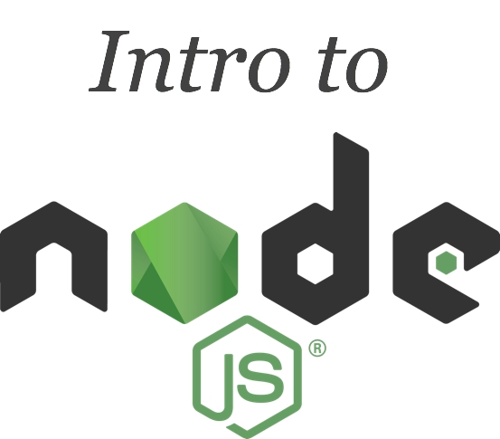

# Introduction

## Sponsor

[litmis.com](http://litmis.com/) \| [@litmisteam](https://twitter.com/litmisteam) \| [team@litmis.com](mailto:team@litmis.com)

## Introduction

Welcome to the Node.js lab. Node.js is defined as follows on nodejs.org:

_Node.js® is a JavaScript runtime built on Chrome's V8 JavaScript engine. Node.js uses an event-driven, non-blocking I/O model that makes it lightweight and efficient. Node.js' package ecosystem, npm, is the largest ecosystem of open source libraries in the world._

Sounds exciting! But what does this mean?

This course will guide you through foundational concepts of Node.js.

Node.js is built on Javascript. This course is not meant to teach you Javascript, though there are some Javascript idiosyncrasies that are essential to understand in order to be a successful Node.js coder. We will be covering those topics.

This course is both a lab and a reference. It is a lab considering there is an end application that is to be built. It’s also a reference that acknowledges the necessity to describe minute details which are foundationally necessary concepts.

### Conventions

* When you see a % sign that means you are at a shell prompt \(aka PASE environment on IBM i\)
* When you see `>` that means you are in the Node.js REPL \(more on that later\).

## Summary

* [Introduction](./)
* [Step 1: Litmis Space Configuration](pages/step-1-litmis-space-configuration.md)
* [Step 2: Hello World!](pages/step-2-hello-world.md)
* [Step 3: REPL Intro](pages/step-3-repl-intro.md)
* [Step 4: Javascript, A Quick Intro](pages/step-4-javascript-a-quick-intro.md)
* [Step 5: npm, The Package Manager](pages/step-5-npm-the-package-manager.md)
* [Step 8: Connecting to DB2](pages/step-8-connecting-to-db2.md)
* [Step 9: The View Layer](pages/step-9-the-view-layer.md)
* [Step 10: Creating CRUD](pages/step-10-creating-crud.md)
* [Step 11: Websockets](pages/step-11-websockets.md)
* [Future Topics ](pages/future-topics.md)

Proceed to [Step 1: Litmis Space Configuration](pages/step-1-litmis-space-configuration.md)
