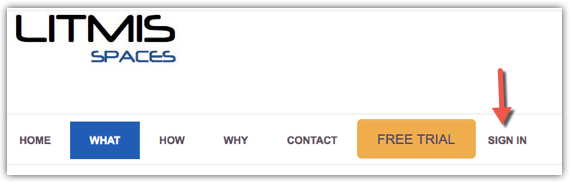
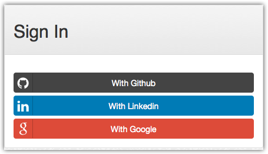
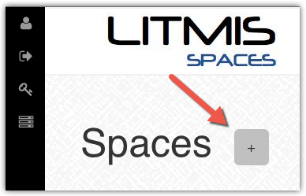
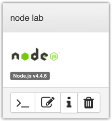

# Step 1: Litmis Space Configuration

## Step 1: Litmis Space Configuration

This is a lab to meant to give you exposure on how Node.js works on the IBM i platform. Labs are conducted on [Litmis Spaces Multi Tenant](http://litmis.com/spaces); a service from Krengeltech to provide preconfigured open source environments on IBM i cloud instances.

**In short, everything can be done through the browser - no need to install big IDEs on your desktop. Happy day!**

Go to [https://spaces.litmis.com](https://spaces.litmis.com) _\(Ctrl+click to open new tab\)_ and select SIGN IN, as show below.



Select the authentication mechanism of your choice. If you don't have an account with the options listed, sign up for a free Github.com profile and return back to this page once your Github profile is setup.



Once logged in you can create a new space, as shown below.



You will be presented with the below pop-up. Give a name to this space, enter the promo code of **BETA**, **select the \*\***_Node.js_**\*\* radio button**, and click the Create button.


Now you should see a new box on your page that represents your newly created Space.



There are four buttons which constitute actions you can take with your Space. They are \(left to right\):

* **Shell prompt.** You will use this to enter commands in the PASE environment on the IBM i. This is browser-based and doesn't require any software to be installed on your desktop.
* **Editor.** Where you will edit your source code and navigate the IFS \(Integrated File System\). This is browser-based and doesn't require any software to be installed on your desktop.
* **Space Information.** Here you will find information about your space such as user profile, database schemas \(aka libraries\), ports for your web app to listen, Space id, etc.
* **Delete Space.** **WARNING!** If you select this option and the subsequent warning prompt, your Space will be deleted. This CANNOT be undone.

## Environment Variables

Each environment has specific settings that are stored in PASE environment variables. They are as follows. When you log into a PASE shell these are automatically set for you. You should not modify these values. You will see them referenced in the lab.

**NOTE:** The below is informational only. You don't need to do anything.

```text
export LITMIS_SPACE_GUID=xxxx
export LITMIS_SPACE_USER=USRxxxxx
export LITMIS_SCHEMA_DEVELOPMENT=xxxxx_D
export LITMIS_SCHEMA_TEST=xxxxx_T
export LITMIS_SCHEMA_PRODUCTION=xxxxx_P
export LITMIS_PORT_DEVELOPMENT=11111
export LITMIS_PORT_TEST=22222
export LITMIS_PORT_PRODUCTION=33333
```

### Proceed to [Step 2: Hello World](step-2-hello-world.md)

