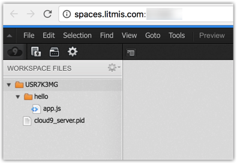

# Step 2: Hello World!

This next step requires opening the shell so we can type commands into PASE on IBM i. Below is the button you need to press to open the shell \(aka terminal\).


Node.js has already been installed in your Litmis Space so we won't be going over those details here. With that said it is necessary to verify the installation which can be done with the below command from the Shell \(aka terminal\).

```bash
% node -v
v6.9.1
```

As you can see we are running version 6.9.1 of Node.js which is the current version as of this writing.

Sometimes the best way to learn something is to get a quick "win". In an effort to not disrupt the balance of language introduction we’re going to create a hello world application.

First create a new directory to hold this new application, cd \(change directory\) into it, and touch `app.js` to create it.

```text
% mkdir hello
% cd hello 
% touch app.js
```

Now go back to your Litmis Spaces page and click the editor button, as shown below.


This will open a new browser tab with the browser-based editor, as shown below. **NOTE:** To see newly created files like `hello/app.js` you will need to right click on the root folder and select "Refresh".



Now go to the browser-based editor and paste \(`Ctrl+Shift+V`\) the following into the newly created `app.js` file. You may need to right click in the directory tree to refresh the list.

**NOTE:** Make sure to save your source by using `Ctrl+S` or menu `File->Save`.

**NOTE:** To copy source you should select the copy icon in the upper right corner of the of the source box.

```javascript
var http = require('http')
var port = process.env.LITMIS_PORT_DEVELOPMENT
http.createServer(function(req, res) {
  res.writeHead(200, {'Content-Type': 'text/plain'})
  res.end('Hello World')
}).listen(port, '0.0.0.0')
console.log('Server running at http://0.0.0.0:%d', port)
```

Now go back to your console and enter the following command to start your application.

```bash
% node app.js 

Server running at http://0.0.0.0:60263
```

As you can see it output the value we placed in the call to `console.log\(...\)`. Now open a new tab in your browser and enter `spaces.litmis.com:<your-port>`. Replace "" with the value you see in the console, `60263` in my case, though yours will be different. You should see the below screenshot.


**Wow! That was simple!**

The `process.env.LITMIS_PORT_DEVELOPMENT` line is accessing an environment variable that contains a port that has been allocated to your user profile. You can learn more about these values by going to your [Spaces page](https://spaces.litmis.com/workspaces) and select the information button, as shown below.


Then in the pop-up window you should see the below section where the ports are delineated.


For the fun of it let's add a log each time a request is made.  Insert the console.log as shown on line 6.

```javascript
var http = require('http')
var port = process.env.LITMIS_PORT_DEVELOPMENT
http.createServer(function(req, res) {
 res.writeHead(200, {'Content-Type': 'text/plain'})
 res.end('Hello World')
 console.log('Request came in at: ' + new Date())
}).listen(port, '0.0.0.0')

console.log('Server running at http://0.0.0.0:%d', port)
```

Now go back to your console and hit `Ctrl+C` to end the current application. Then hit the up arrow to bring up the previous command and hit enter to run it again, as shown below. Restarting the Node.js application is necessary so it can pick up the code changes.

```bash
% node app.js
Server running at http://0.0.0.0:60263
Request came in at: Mon Feb 22 2016 21:53:50 GMT+0000 (EST)
Request came in at: Mon Feb 22 2016 21:53:53 GMT+0000 (EST)
Request came in at: Mon Feb 22 2016 21:53:59 GMT+0000 (EST)
```

Refresh the hello world browser tab a few times and you should see additional log lines in the console with timestamps.

### Proceed to [Step 3: REPL Intro](step-3-repl-intro.md)