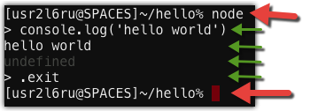

# Step 3: REPL Intro

Included with Node.js is the [REPL tool](https://nodejs.org/api/repl.html). REPL stands for **R**ead, **E**val, **P**rint, and **L**oop and is a way to interactively run Javascript and see the results immediately. I use the Node.js REPL on a regular basis to test small snippets of code.

To start a REPL you invoke the node command without any parameters, as shown below. If your web application is still running from the previous hello world example, end it with `Ctrl+C`.



Once inside a REPL you can enter other Node.js \(and Javascript\) statements. Shown above we use `console.log(...)` to write a message to the terminal. The red arrows signify being in the PASE shell. Green arrows signify being in the Node REPL. Use `.exit` to return to the PASE shell.

Taking that example further, you can actually paste \(`Ctrl+Shift+V`\) the entire contents of the `hello/app.js` program into a Node.js REPL and it will execute all the code and run your web app, as shown below.

NOTE: The below is the output of pasting the contents from `hello/app.js` into a REPL session. Don't paste the below into a REPL session.

```bash
% node                                                        
> var http = require('http')                                                    
undefined                                                                       
> var port = process.env.LITMIS_PORT_DEVELOPMENT                                
undefined                                                                       
> http.createServer(function(req, res) {                                        
... res.writeHead(200, {'Content-Type': 'text/plain'})                          
... res.end('Hello World')                                                      
... console.log('Request came in at: ' + new Date())                            
... }).listen(port, '0.0.0.0')                                                  
Server {                                                                        
  domain:                                                                       
   Domain {                                                                     
     domain: null,                                                              
     _events: { error: [Function] },                                            
     _eventsCount: 1,                                                           
     _maxListeners: undefined,                                                  
     members: [] },                                                             
  _events:                                                                      
   { request: [Function],                                                       
     connection: [Function: connectionListener] },                              
  _eventsCount: 2,                                                              
  _maxListeners: undefined,                                                     
  _connections: 0,                                                              
  _handle: null,                                                                
  _usingSlaves: false,                                                          
  _slaves: [],                                                                  
  _unref: false,                                                                
  allowHalfOpen: true,                                                          
  pauseOnConnect: false,                                                        
  httpAllowHalfOpen: false,                                                     
  timeout: 120000,                                                              
  _pendingResponseData: 0 }                                                     
>                                                                               
> console.log('Server running at http://0.0.0.0:%d', port)                      

Server running at http://0.0.0.0:62528                                          
undefined                                                                       
> Request came in at: Thu Feb 23 2017 14:41:54 GMT+0000 (EST)
```

Now if you bring up your browser again you can see the same results as if you had run `node app.js` from the shell. To end this Node.js REPL session select `Ctrl+C` twice.

There will be more examples of how to use the Node.js REPL later on.

### Proceed to [Step 4: Javascript Intro](step-4-javascript-a-quick-intro.md)
