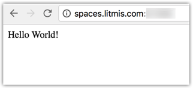

# Step 5: npm, The Package Manager

Node.js has what's called a "package manager." Wikipedia.org gives the following definition to package managers:

_A package manager or package management system is a collection of software tools that automates the process of installing, upgrading, configuring, and removing software packages for a computer’s operating system in a consistent manner. It typically maintains a database of software dependencies and version information to prevent software mismatches and missing prerequisites._

Package managers aren’t a new concept, though I believe they’re getting incrementally better. Such is the case with the Node.js Package Manager, npm for short. The npm tool makes it easy for JavaScript developers to share, reuse and maintain code. Publicly available npms are hosted on [npmjs.com](https://www.npmjs.com/). Here you’ll find a vast repository where many thousands of Node.js packages reside. The best part is it’s free to the community—\(one of the reasons Node.js has taken off so well\).

Now let's test npm to see how it works. First change to your home directory and create a new directory named app1 and cd into it, as shown below. Note the tilde \(`~`\) is a shortcut to the home directory. Note the two ampersands \(`&&`\) are a way to combine two commands on a single line.

```bash
% cd ~/
% mkdir app1 && cd app1
```

Now run `npm init` to create what's called the `package.json` file which will hold information about the application like the author, a description, and dependencies. You will be prompted for many values, as shown below. Provide input or hit the `Enter` key to accept the default.

```bash
% npm init
This utility will walk you through creating a package.json file.
It only covers the most common items, and tries to guess sensible defaults.
See `npm help json` for definitive documentation on these fields
and exactly what they do.
Use `npm install <pkg> --save` afterwards to install a package and
save it as a dependency in the package.json file.
Press ^C at any time to quit.
name: (app1) 
version: (1.0.0) 
description: My first Node.js app
entry point: (index.js) 
test command: 
git repository: 
keywords: 
author: 
license: (ISC) 
About to write to /home/USR2L6RU/app1/package.json:
{
  "name": "app1",
  "version": "1.0.0",
  "description": "My first Node.js app",
  "main": "index.js",
  "scripts": {
    "test": "echo \"Error: no test specified\" && exit 1"
  },
  "author": "",
  "license": "ISC"
}

Is this ok? (yes)
```

You now have a file named `packages.json` and can view it using the `cat` command, as shown below.

```bash
% cat package.json 
{
  "name": "app1",
  "version": "1.0.0",
  "description": "My first Node.js app",
  "main": "index.js",
  "scripts": {
    "test": "echo \"Error: no test specified\" && exit 1"
  },
  "author": "",
  "license": "ISC"
}
```

Next we will install one of the most popular Node.js modules - a web framework named [Express](http://expressjs.com/) which will be used to build a web app. The `--save` option tells `npm` to add express as a dependency in `package.json`.

```bash
% npm install express --save
express@4.13.4 node_modules/express
├── array-flatten@1.1.1
├── escape-html@1.0.3
├── utils-merge@1.0.0
├── merge-descriptors@1.0.1
├── methods@1.1.2
├── cookie-signature@1.0.6
├── fresh@0.3.0
├── range-parser@1.0.3
├── vary@1.0.1
├── path-to-regexp@0.1.7
├── parseurl@1.3.1
├── cookie@0.1.5
├── etag@1.7.0
├── content-type@1.0.1
├── content-disposition@0.5.1
├── serve-static@1.10.2
├── depd@1.1.0
├── on-finished@2.3.0 (ee-first@1.1.1)
├── finalhandler@0.4.1 (unpipe@1.0.0)
├── qs@4.0.0
├── debug@2.2.0 (ms@0.7.1)
├── proxy-addr@1.0.10 (forwarded@0.1.0, ipaddr.js@1.0.5)
├── send@0.13.1 (destroy@1.0.4, statuses@1.2.1, ms@0.7.1, mime@1.3.4, http-errors@1.3.1)
├── accepts@1.2.13 (negotiator@0.5.3, mime-types@2.1.10)
└── type-is@1.6.12 (media-typer@0.3.0, mime-types@2.1.10)
```

After installing the `express` module you should see a log, as shown above. When `npm` downloads `express` it looks at its `package.json` file to learn what other dependencies need to be downloaded and also obtains them. This is a recursive process until the end of the dependency list is reached. All the downloaded modules are stored in the `node_modules/` directory of your current directory.

Now create a new file named `index.js` in directory `app1` and paste the following content into it so we can see Express in action.

```javascript
var express = require('express')
var app = express()

app.get('/', function(req, res) {
  res.send('Hello World!')
})

var port = process.env.PORT || process.env.LITMIS_PORT_DEVELOPMENT
app.listen(port, function() {
  console.log('Running on port %d', port)
})
```

This is another hello world example using Express instead of going direct to the base Node.js capabilities. The first line is bringing in the `express` module. Notice there isn't a relative path specified. You can omit the path because the express module is located in the `node_modules/` directory, which is part of the search path when loading modules.

Line 2 is obtaining a reference to the Express application object which is subsequently used on line 4 to listen for the "root route". A "route" is a path from the browser to code in your Node.js application. In this case we have a single route \(i.e. `'/'`\) defined so when we bring up the root of the website it will display **"Hello World!"**.

On line 8 we occupy the port variable, though it is slightly different this time. The double vertical pipe syntax \(`||`\) is the _or_ operator which will first check whether `process.env.PORT` has a value. If not, it will occupy it with the value to the right of the vertical pipes \(i.e. `LITMIS_PORT_DEVELOPMENT`\). The `process.env` object gives us access to environment variables from the current process \(aka IBM i job\). What this means is an overriding port can be passed when starting the application, as shown below. Go ahead and try running your app on the various ports dedicated to your profile.

**Reminder:** Your ports are located in the Space information pop-up \(the 'i' button\).

```bash
% PORT=60263 node index.js
Running on port 60263
```

Notice how `PORT=60263` is specified _before_ the node `index.js` portion. This is valid syntax and is basically setting the `PORT` environment variable for only the duration of this particular call to the node binary. If you wanted to have the `PORT` environment variable to be set at the process \(aka IBM i job\) level then you'd use `export PORT=602604`.

Go ahead and open a browser window to see your Express hello world app running, as shown below.



### Proceed to [Step 6: Connecting to DB2](step-6-connecting-to-db2.md)