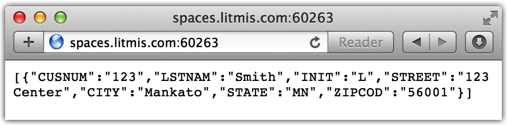

# Step 6: Connecting to DB2

Connecting to DB2 from Node.js is very straight forward. We don't need to run `npm install` because IBM delivers a [DB2 adapter/driver](http://bit.ly/nodejs_db2foriaccess) with Node.js. The DB2 adapter/driver doesn't actually exist on npmjs.com so it couldn't be installed in that fashion anyway.

Before we modify the Node.js web application we need to create a DB2 table in the schema \(aka library\) reserved to your profile. Your DB2 schema can be found on the same info screen as the port from earlier in this tutorial.

Paste the below contents into a new file named `sql.js`.

```javascript
const db = require('/QOpenSys/QIBM/ProdData/OPS/Node6/os400/db2i/lib/db2a')

const dbconn = new db.dbconn()
dbconn.conn("*LOCAL")
const stmt = new db.dbstmt(dbconn)

const schema = process.env.LITMIS_SCHEMA_DEVELOPMENT
let sql =
`CREATE TABLE ${schema}.CUSTOMER ( \
CUSNUM NUMERIC(6, 0),            \
LSTNAM VARCHAR(50),              \
INIT CHAR(1),                    \
STREET VARCHAR(100),             \
CITY VARCHAR(100),               \
STATE CHAR(2),                   \
ZIPCOD NUMERIC(5, 0)             \
)`
stmt.exec(sql, function(result, err){
  console.log('result:' + result)

  sql = `INSERT INTO ${schema}.CUSTOMER VALUES (123,'Smith','L','123 Center','Mankato','MN',56001)`
  stmt.exec(sql, function(result,err){
    console.log('result:' + result)

    sql = `select * from ${schema}.systables WHERE TABLE_TYPE='T'`
    stmt.exec(sql, function(result,err) {
      console.log('result:' + JSON.stringify(result))
    })
  })
})
```

Now invoke the program as follows.

`% node sql.js`

**Note:** If you see `error: undefined` or similar in your console that means there wasn't an error specified in the error return field.

The first line is a fully qualified path to where the `db2a.js` file lives in the IFS. Note you can omit the `.js` extension because `require(...)` will assume that extension. The `db.conn("*LOCAL")` will connect to the local database and use the profile this script is running under for authorization. You could also specify a different profile and password.

The `stmt.exec(...)` lines are where the action happens. You'll notice the `stmt.exec` functions are inside each other. This is because we need to make sure the next SQL statement doesn't start before the current one completes. If this seems odd then you are in good company because it is very different than how other programming languages work. With this you can see how Javascript's asynchronous processing is a first class citizen. If the `stmt.exec` statements were one after each other then that would mean they would be invoked concurrently. That would obviously be an issue in this case because we can't `INSERT` a row before the `CREATE TABLE` is complete.

The third query of `systables` is performed so we can learn whether the `CREATE TABLE` was successful. You should see output similar to the following. I have formatted the below output so it is easier to decipher.

```text
[ { TABLE_NAME: 'CUSTOMER',
    TABLE_OWNER: 'USRxxxxx',
    TABLE_TYPE: 'T',
    COLUMN_COUNT: '7',
    ROW_LENGTH: '43',
    TABLE_TEXT: '',
    LONG_COMMENT: '',
    TABLE_SCHEMA: 'xxxxx_D',
    LAST_ALTERED_TIMESTAMP: '2016-03-02-17.09.23.654000',
    SYSTEM_TABLE_NAME: 'CUSTOMER  ',
    SYSTEM_TABLE_SCHEMA: 'xxxxx_D   ',
    FILE_TYPE: 'D',
    BASE_TABLE_CATALOG: '',
    BASE_TABLE_SCHEMA: '',
    BASE_TABLE_NAME: '',
    BASE_TABLE_MEMBER: '',
    SYSTEM_TABLE: 'N',
    SELECT_OMIT: 'N',
    IS_INSERTABLE_INTO: 'YES',
    IASP_NUMBER: '0',
    ENABLED: '',
    MAINTENANCE: '',
    REFRESH: '',
    REFRESH_TIME: '0001-01-01-00.00.00.000000',
    MQT_DEFINITION: '@@@@@@@@@@@@@@@@@@@@@@@@@@',
    ISOLATION: '  ',
    PARTITION_TABLE: 'NO',
    TABLE_DEFINER: 'USRxxxxx',
    MQT_RESTORE_DEFERRED: ' ',
    ROUNDING_MODE: ' ',
    CONTROL: ' ' } ]
```

Next we need to modify our web app to use the new `CUSTOMER` table. Below is the modified `index.js` program.

```javascript
const db = require('/QOpenSys/QIBM/ProdData/OPS/Node6/os400/db2i/lib/db2a')
const dbconn = new db.dbconn()
dbconn.conn("*LOCAL")
const stmt = new db.dbstmt(dbconn)
const schema = process.env.LITMIS_SCHEMA_DEVELOPMENT

var express = require('express')
var app = express()

app.get('/', function(req, res) {
  let stmt = new db.dbstmt(dbconn)
  stmt.exec(`SELECT * FROM ${schema}.CUSTOMER`, function(results, err) {
   res.json(results)
   stmt.close()
  })
})

var port = process.env.PORT || process.env.LITMIS_PORT_DEVELOPMENT
app.listen(port, function() {
  console.log('Running on port %d', port)
})
```

The database changes have already been covered but you'll also note that instead of `res.send(...)` we are using `res.json(...)`. This will change the `Content-type` header that's sent back down to the client, among other things. I did this to introduce you to another way to send a response.

Make the previous changes to your `index.js` file and then start your application again, as shown below.

```bash
% node index.js 
Running on port 60263
```

Open your browser and you should see something similar to the below screenshot.



**Victory! Your Node.js is connecting to the database.**

### Proceed to [Step 7: The View Layer](step-7-the-view-layer.md)