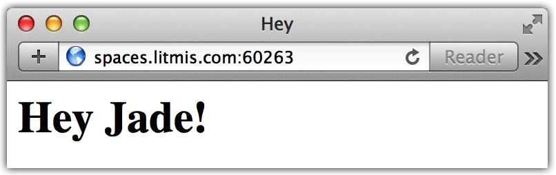
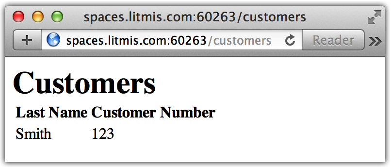
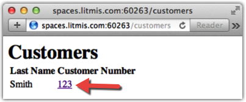
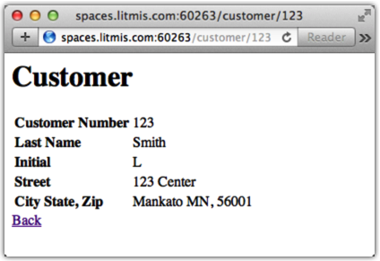

# Step 7: The View Layer

Next, we want to further develop the application by implementing a template engine to simplify the creation of dynamic HTML pages. We’ll use the [pug](https://www.npmjs.com/package/pug) template engine due to its popularity and flexibility. To install pug, we will again go to the `npm install` command. This time we’ll add a `--save` option at the end to declare we’d like this retained in the `package.json` file.

```bash
% npm install pug --save
app1@1.0.0 /home/USRxxxxx/app1                                                  
`-- pug@2.0.0-beta11
  +-- pug-code-gen@1.1.1
  | +-- constantinople@3.1.0
  | | +-- acorn@3.3.0                                                           
  | | `-- is-expression@2.1.0                                                   
  | +-- doctypes@1.1.0                                                          
  | +-- js-stringify@1.0.2                                                      
  | +-- pug-attrs@2.0.2                                                         
  | +-- pug-error@1.3.2                                                         
  | +-- void-elements@2.0.1                                                     
  | `-- with@5.1.1                                                              
  |   `-- acorn-globals@3.1.0                                                   
  |     `-- acorn@4.0.11                                                        
  +-- pug-filters@2.1.1                                                         
  | +-- clean-css@3.4.24                                                        
  | | +-- commander@2.8.1                                                       
  | | | `-- graceful-readlink@1.0.1                                             
  | | `-- source-map@0.4.4                                                      
  | |   `-- amdefine@1.0.1                                                      
  | +-- jstransformer@1.0.0                                                     
  | | +-- is-promise@2.1.0                                                      
  | | `-- promise@7.1.1                                                         
  | |   `-- asap@2.0.5                                                          
  | +-- pug-walk@1.1.1                                                          
  | +-- resolve@1.2.0                                                           
  | `-- uglify-js@2.7.5                                                         
  |   +-- async@0.2.10                                                          
  |   +-- source-map@0.5.6                                                      
  |   +-- uglify-to-browserify@1.0.2                                            
  |   `-- yargs@3.10.0                                                          
  |     +-- camelcase@1.2.1                                                     
  |     +-- cliui@2.1.0                                                         
  |     | +-- center-align@0.1.3  
  |     | | +-- align-text@0.1.4                                                
  |     | | | +-- kind-of@3.1.0                                                 
  |     | | | | `-- is-buffer@1.1.4                                             
  |     | | | +-- longest@1.0.1                                               
  |     | | | `-- repeat-string@1.6.1                                           
  |     | | `-- lazy-cache@1.0.4                                                
  |     | +-- right-align@0.1.3                                                 
  |     | `-- wordwrap@0.0.2                                                    
  |     +-- decamelize@1.2.0                                                    
  |     `-- window-size@0.1.0                                                   
  +-- pug-lexer@3.0.0                                                           
  | +-- character-parser@2.2.0                                                  
  | | `-- is-regex@1.0.4                                                        
  | |   `-- has@1.0.1                                                           
  | |     `-- function-bind@1.1.0                                               
  | `-- is-expression@3.0.0                                                     
  |   `-- acorn@4.0.11                                                          
  +-- pug-linker@2.0.2                                                          
  +-- pug-load@2.0.5                                                            
  | `-- object-assign@4.1.1                                                     
  +-- pug-parser@2.0.2                                                          
  | `-- token-stream@0.0.1                                                     
  +-- pug-runtime@2.0.3                                                         
  `-- pug-strip-comments@1.0.2
```

Using the `cat` command we can see the modified `package.json` file with reference to the `pug` module.

```bash
% cat package.json 
{
  "name": "app1",
  "version": "1.0.0",
  "description": "My first Node.js app",
  "main": "index.js",
  "scripts": {
    "test": "echo \"Error: no test specified\" && exit 1"
  },
  "author": "",
  "license": "ISC",
  "dependencies": {
    "express": "^4.13.4",
    "pug": "^2.0.0-beta11"
  }
}
```

Next, we need to create a folder to hold our new template engine files so we can keep them separate and organized from the rest of the application. Run the following `mkdir` command to create a directory named `views`.

```bash
% mkdir views
```

**NOTE:** In the browser-based code editor you can right click on the root folder and select "Refresh" to see any files or folders you've created from the shell.

Within the `views` directory, create a file named `index.pug` and populate it with the following text, making sure to retain the leading spaces.

```markup
html
  head
    title!= title
  body
    h1!= message
```

What you see is Pug syntax that aims to make HTML composition significantly less "noisy". Indentation in Pug allows us to declare when closing tags should be assumptively inserted. For example, the head tag will close when the body tag is encountered because they’re at the same indentation depth \(two spaces\).

When you see an equal sign \(=\), or exclamation plus equal sign \(!=\), it means the content on the right is a variable made available to the view from the controller. There are many more aspects you can learn about in the [Pug reference](https://pugjs.org/api/reference.html).

Below are the necessary Pug additions for views to work in `index.js.` First, we use `app.set(...)` to declare the directory where views are stored and then set the view engine to 'pug'. Once the view engine is set, we can alter the contents of `app.get(...)` to invoke `res.render()`, passing the name of the view \(`index`\) and set named variables we want to pass to the view — namely title and message.

```javascript
const db = require('/QOpenSys/QIBM/ProdData/OPS/Node6/os400/db2i/lib/db2a')

const dbconn = new db.dbconn()
dbconn.conn("*LOCAL")
const schema = process.env.LITMIS_SCHEMA_DEVELOPMENT

var express = require('express')
var app = express()

app.set('views', __dirname + '/views')
app.set('view engine', 'pug')

app.get('/', function(req, res) {
 res.render('index', { title: 'Hey', message: 'Hey Jade!'})
})

app.get('/', function(req, res) {
  let stmt = new db.dbstmt(dbconn)
  stmt.exec(`SELECT * FROM ${schema}.CUSTOMER`, function(results, err) {
   res.json(results)
   stmt.close()
  })
})


var port = process.env.PORT || process.env.LITMIS_PORT_DEVELOPMENT
app.listen(port, function() {
  console.log('Running on port %d', port)
})
```

At this point we’re ready to start the application with the following command. If your application is still running from last time, you’ll need to first end it \(i.e., `Ctrl + C`\) to pick up the latest changes in index.js.

```bash
% node index.js
```

Below is a screenshot of what you should now be seeing.



Now that we know how to pass variables to the view layer, let’s make it a bit more dynamic by retrieving database rows to display a list of customers from table `CUSTOMER` that was created earlier. To accomplish this, we’re first going to create a new file named `customers.pug` in the views directory and populate it with the following content.

```javascript
h1=title
  table
    thead
      tr
        th Last Name
        th Customer Number
    tbody
      each row in results
        tr
          td=row.LSTNAM
          td=row.CUSNUM
```

Here we learn about Pug’s ability to iterate over a result set using the `each` keyword. The results variable was provided by the controller \(`index.js`\) and the `row` variable is occupied with an SQL row at each iteration. `LSTNAM` and `CUSNUM` are columns from DB2 table `CUSTOMER`.

Next, we need to make changes to `index.js` that query DB2 to provide the results variable to the `customers.pug` view, as shown.

```javascript
app.get('/customers', function(req, res) {
  let stmt = new db.dbstmt(dbconn)
  stmt.exec(`SELECT LSTNAM, CUSNUM FROM ${schema}.CUSTOMER`, function(results) {
    res.render('customers', { title: 'Customers', results: results})
  })
})
```

The first parameter of `res.render(...)` is declaring what view, minus the extension of `.pug`, to render. The second parameter is a Javascript object \(curly brackets\) with variables that will be passed to the UI layer. Restart your application \(`Ctrl + C`, then run `node index.js`\) and you should see the following in your browser.

**NOTE:** There is now `/customers` at the end of the URL.



Next, let’s introduce a feature of displaying more information about a customer when it’s clicked. We can do that by modifying the `td` tag holding the `CUSNUM` value to have a dynamically generated link to that specific customer, as shown. The `${...}` syntax is [string interpolation](http://jade-lang.com/reference/interpolation/) and makes referencing variables in strings significantly easier.

```javascript
h1=title
  table
    thead
      tr
        th Last Name
        th Customer Number
    tbody
      each row in results
        tr
          td=row.LSTNAM
          td: a(href=`/customer/${row.CUSNUM}`)=row.CUSNUM
```

Now we need to add code to `index.js` to process requests for specific customers, as shown below. Add this code towards the bottom immediately before we assign the port variable.

```javascript
app.get('/customer/:id', function(req, res) {
  let stmt = new db.dbstmt(dbconn)
  var sql = `SELECT * FROM ${schema}.CUSTOMER WHERE CUSNUM=` + req.params.id
  stmt.exec(sql, function(result, err) {
    res.render('customer', { title: 'Customer', result: result[0]})
    stmt.close()
  })
})
```

Note the :id reference in the first parameter of `app.get(...)`. This says that whatever is specified on the URL after `/customer/` should be placed into a variable named `id` within the `req.params` object. We can then access it with the syntax `req.params.id` and concatenate it into the SQL statement. After `stmt.exec(...)` is run we get the `result` _array_ object. Then we use `result[0]` to set the result view variable to the first element in the array.

**NOTE:** This SQL statement is open to injection attacks. Read more [here](https://en.wikipedia.org/wiki/SQL_injection) if you'd like.

Restarting your application and navigating to `/customers` should reveal the results shown below. Notice how the customer number is now a link.



Next, create a `customer.pug` file in the `views` directory to facilitate the previous `res.render('customer', ...)`, as shown below. Note that this view was singular and the other one was plural \(`customer.pug` vs. `customers.pug`\) as that’s a common convention.

```javascript
h1=title
table
  tr
    td: b Customer Number
    td=result.CUSNUM
  tr
    td: b Last Name
    td=result.LSTNAM
  tr
    td: b Initial
    td=result.INIT
  tr
    td: b Street
    td=result.STREET
  tr
    td: b City State, Zip
    td= result.CITY + " " + result.STATE + ", " + result.ZIPCOD
a(href='/customers') Back
```

Restart the application, go to the `/customers` page and click on a customer. You should see a page similar to the below.



### Proceed to [Step 8: Creating Crud](step-8-creating-crud.md)
