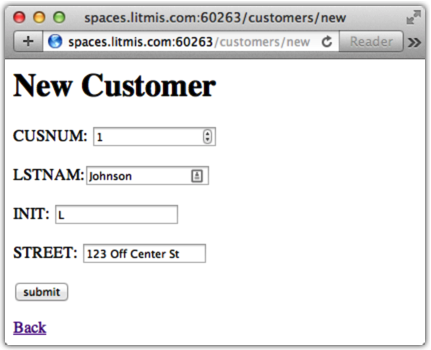

# Step 8: Creating CRUD

Now it's time to make this application have full CRUD \(**C**reate, **R**ead, **U**pdate, **D**elete\) capabilities.

In the previous section we created a `views` directory and placed `index.pug` \(home page\), `customers.pug` \(customer listing\) and `customer.pug` \(show a single customer\) in it. To better organize for application growth, we will create directory `views/customers` and rename `customers.pug` to `index.pug` and `customer.pug` to `show.pug`, and put them both in this new directory. I've laid out the commands necessary to accomplish this task below.

**NOTE:** The `pwd` command prints your working directory so you know where you are in the file system.

```bash
% pwd
/home/USRxxxxx/app1
% mkdir views/customers
% mv views/customers.pug views/customers/index.pug
% mv views/customer.pug views/customers/show.pug
```

Since we’re adding create and update capabilities to the application, we need to compose some new view files, specifically `views/customers/new.pug` and `views/customers/edit.pug`.

Below is the content for `new.pug`.

```javascript
h1 New Customer
include _form
a(href='/customers') Back
```

Below is the content for `edit.pug`.

```javascript
h1 Edit Customer
include _form
a(href='/customers') Back
```

Notice the `include _form` portion. This is bringing in what's called a "partial" named `_form.pug`, which also needs to be created in the `views/customers` directory. Partials are similar to doing a `/COPY` in RPG to bring in an external sub routine or procedure. Create the file `views/customers/_form.pug` and occupy it with the below content.

```javascript
form(method="post",action=form_action)
  p CUSNUM: 
    input(type="number", name="CUSNUM", value=result.CUSNUM)
  p LSTNAM:
    input(type="text", name="LSTNAM", value=result.LSTNAM)
  p INIT: 
    input(type="text", name="INIT", value=result.INIT)
  p STREET: 
    input(type="text", name="STREET", value=result.STREET)
  p
    button(type="submit") submit
```

When specifying `include` you don't need to specify the `.pug` extension. Also, view files prefixed with underscores denote they are partials \(it's a naming convention\). This partial will be used for both new and edit scenarios, which is why we modularized it into a partial. More on this later when we get to the controller code in `index.js`.

The last view layer change is to `views/customers/index.pug`, as shown.

```javascript
a(href='/customers/new') New Customer 
h1=title
  table
    thead
      tr
        th Last Name
        th Customer Number
        th
        th
    tbody
      each row in results
        tr
          td=row.LSTNAM
          td: a(href=`/customers/${row.CUSNUM}`)=row.CUSNUM  
          td: a(href=`/customers/${row.CUSNUM}/edit`) edit
          td: a(href=`/customers/${row.CUSNUM}/delete`) delete
```

Links to "New Customer," "edit", and "delete" have been added. Notice how the "New Customer" link doesn't have a reference to a particular customer and "edit"/"delete" does \(i.e., `row.CUSNUM`\). By specifying `row.CUSNUM` we turn the URL into something similar to an RPG CHAIN, allowing the `index.js` controller code to know which row in the database should be acted upon.

Now it's time to make fairly extensive changes to `index.js`. Below is the entirety of the `index.js` file. Review them and then read on to learn what the new sections accomplish.

```javascript
const db = require('/QOpenSys/QIBM/ProdData/OPS/Node6/os400/db2i/lib/db2a')
const body_parser = require('body-parser')
const express = require('express')
const app = express()

const dbconn = new db.dbconn()
dbconn.conn("*LOCAL")
const stmt = new db.dbstmt(dbconn)

const schema = process.env.LITMIS_SCHEMA_DEVELOPMENT

app.set('views', __dirname + '/views')
app.set('view engine', 'pug')

app.use(body_parser.urlencoded({ extended: true }))

app.get('/', function(req, res) {
  res.render('index', { title: 'Hey', message: 'Hey Jade!'})
})

app.get('/customers', function(req, res) {
  let stmt = new db.dbstmt(dbconn)
  stmt.exec(`SELECT LSTNAM, CUSNUM FROM ${schema}.CUSTOMER`, function(results, err) {
    res.render('customers/index', { title: 'Customers', results: results})
    stmt.close()
  })
})

app.get('/customers/new', function(req, res) {
  res.render('customers/new', {result: {}, form_action: '/customers/create'})
})

app.post('/customers/create', function(req, res) {
  let stmt = new db.dbstmt(dbconn)
  var sql = 
    `INSERT INTO ${schema}.CUSTOMER (CUSNUM,LSTNAM,INIT,STREET) VALUES (${req.body.CUSNUM}, '${req.body.LSTNAM}', '${req.body.INIT}', '${req.body.STREET}')`
  stmt.exec(sql, function(result, err){
    res.redirect('/customers')
    stmt.close()
  })
})

app.get('/customers/:id', function(req, res) {
  let stmt = new db.dbstmt(dbconn)
  var sql = `SELECT * FROM ${schema}.CUSTOMER WHERE CUSNUM=${req.params.id}`
  stmt.exec(sql, function(result, err) {
    res.render('customers/show', { title: 'Customer', result: result[0]})
    stmt.close()
  })
})

app.get('/customers/:id/edit', function(req, res) {
  let stmt = new db.dbstmt(dbconn)
  var sql = `SELECT * FROM ${schema}.CUSTOMER WHERE CUSNUM=${req.params.id}`
  stmt.exec(sql, function(result, err) {
    res.render('customers/edit',
      { title: 'Customer',
        result: result[0],
        form_action: `/customers/${req.params.id}/update`
      }
    )
    stmt.close()
  })
})

app.post('/customers/:id/update', function(req, res) {
  let stmt = new db.dbstmt(dbconn)
  var sql = 
    `UPDATE ${schema}.CUSTOMER SET CUSNUM=${req.body.CUSNUM},LSTNAM='${req.body.LSTNAM}',INIT='${req.body.INIT}',STREET='${req.body.STREET}' WHERE CUSNUM=${req.body.CUSNUM}`
  stmt.exec(sql, function(result, err){
    res.redirect('/customers')
    stmt.close()
  })
})

app.get('/customers/:id/delete', function(req, res) {
  let stmt = new db.dbstmt(dbconn)
  var sql = `DELETE FROM ${schema}.CUSTOMER WHERE CUSNUM=${req.params.id}`
  stmt.exec(sql, function(results, err){
    res.redirect('/customers')  
    stmt.close()
  })
})

var port = process.env.PORT || process.env.LITMIS_PORT_DEVELOPMENT
app.listen(port, function() {
  console.log('Running on port %d', port)
})
```

Now let's wade through the `index.js` changes that turn the original display-only application into a CRUD application. The first change is a new ExpressJs middleware named `body-parser`, as shown below.

```javascript
const body_parser = require('body-parser')

. . .

app.use(body_parser.urlencoded({ extended: true }))
```

This module will take HTML form variables and place them in `req.body` so we can easily access form variables \(i.e., `req.body.CUSNUM`\). Use the following command to install `body-parser`. The `--save` option saves it into `package.json`.

```bash
% npm install body-parser --save
```

Next let’s dive into how the various routes have changed. When displaying data \(i.e., `index.pug` and `show.pug`\) you only need one route to accomplish each task. When multiple user interactions are required \(i.e., display a form and then process it\), then you need multiple routes to make that flow work. For example, consider the `/customers/:id/edit` and `/customers/:id/update` routes below. The `/edit` route is used to first load an existing DB2 entry into a form and the `/update` route is to process the HTML form submission. Notice how the `res.render` in the `/edit` route is setting the `form_action` view variable. This is how the `/edit` and `/new` routes can share the same HTML form, namely the `_form.pug` file.

The `/update` route receives in the form submission, composes and executes an SQL UPDATE statement, and then redirects the user back to the `/customers` route.

```javascript
app.get('/customers/:id/edit', function(req, res) {
  var sql = `SELECT * FROM ${schema}.CUSTOMER WHERE CUSNUM=${req.params.id}`
  stmt.exec(sql, function(result, err) {
    res.render('customers/edit',
      { title: 'Customer',
        result: result[0],
        form_action: `/customers/${req.params.id}/update`
      }
    )
  })
})

app.post('/customers/:id/update', function(req, res) {
  var sql = 
    `UPDATE ${schema}.CUSTOMER SET CUSNUM=${req.body.CUSNUM},LSTNAM='${req.body.LSTNAM}',INIT='${req.body.INIT}',STREET='${req.body.STREET}' WHERE CUSNUM=${req.body.CUSNUM}`
  stmt.exec(sql, function(result, err){
    res.redirect('/customers')
  })
})
```

Below are the `/customers/new` and `/customers/create` routes that are used to display an empty form and process that form’s submission, respectively. This is very similar to the `/edit` and `/update` routes previously described, including the setting of the `form_action` view variable to alter the path that the form will be submitted to.

```javascript
app.get('/customers/new', function(req, res) {
  res.render('customers/new', {result: {}, form_action: '/customers/create'})
})

app.post('/customers/create', function(req, res) {
  var sql = 
    `INSERT INTO ${schema}.CUSTOMER (CUSNUM,LSTNAM,INIT,STREET) VALUES (${req.body.CUSNUM}, '${req.body.LSTNAM}', '${req.body.INIT}', '${req.body.STREET}')`
  stmt.exec(sql, function(result, err){
    res.redirect('/customers')
  })
})
```

And finally, see the `/customers/:id/delete` route for DB2 row removal. I could have been more purist and used `app.delete` for the route. However, that requires more complexity in the view layer and an `app.get` with an `:id` accomplishes the task quite nicely.

```javascript
app.get('/customers/:id/delete', function(req, res) {
  var sql = `DELETE FROM ${schema}.CUSTOMER WHERE CUSNUM=${req.params.id}`
  stmt.exec(sql, function(results, err){
    res.redirect('/customers')  
  })
})
```

Below is a screenshot of the new customer listing.


Below is the **New Customer** page.



Below is the **Edit Customer** page.


**That concludes the Customer CRUD application!**

### Proceed to [Step 9: Websocket tutorial](step-9-websockets.md)
