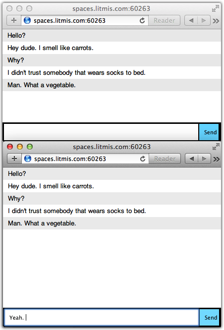
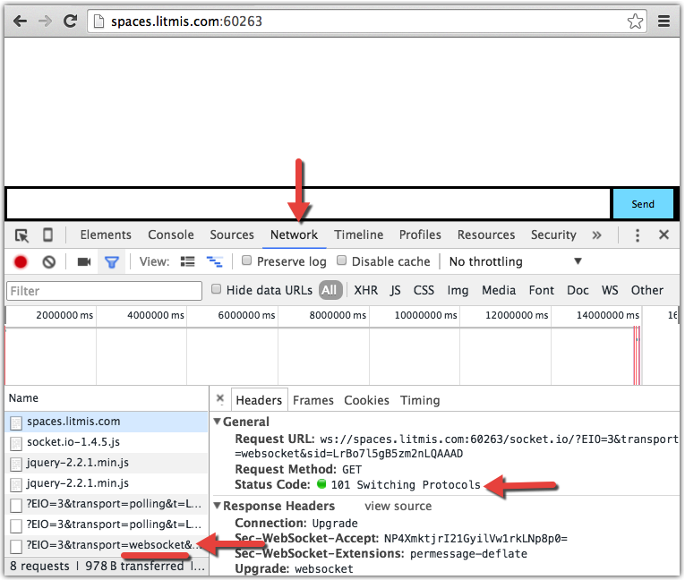

# Step 9: Websockets

Now it's time to use HTML5's WebSockets.

I often find myself wishing things were simpler with web development, specifically the link between the browser and server. I don't want to think as much about the underlying technology. I’d rather focus more on meeting the overall business need. Many technologies have improved in this area over the years using concepts of convention over configuration \(thank you, Ruby on Rails\). Today, I am tooting the horn of JavaScript and Node.js in the implementation of HTML5 WebSockets.

Wikipedia describes HTML5 WebSockets as _"a protocol providing full-duplex communication channels over a single TCP connection"_.

HTML5 is just a specification, not an implementation. It's every technology stack's responsibility to implement said spec - not only to make everything adhere to the spec but also to put some amount of focus on making usage easy for the web developer. In the case of Node.js, we have a Node Package Module \(NPM\) named **socket.io** that implements HTML5 WebSockets with excellence to the point of being surprisingly simple and easy to use.

Our next goal is to use socket.io to create a chat application using HTML5 WebSockets, as shown in the below screenshot.



The concept is that two browser clients will obtain a WebSocket connection to the server. Chat messages entered in one browser are delivered from the server to the client in another browser, without the client polling the server. It is important to note the lack of polling in that last sentence. That’s how things were done in the past. Now, the server can initiate communication down to the client. Very cool!

This application will be created in a new directory. We’ll install everything from scratch. Please run the following commands from your shell console.

```bash
% cd ~
% mkdir websock
% cd websock
% npm init
% npm install express --save
% npm install socket.io --save
% touch index.js index.html
```

The above will create a new directory named `websock`, install the Express and Socket.io modules, and create the only two files this application requires; `index.js` and `index.html`. Paste the below HTML document into index.html.

```markup
<!doctype html>
<html>
  <head>
    <style>
  * { margin: 0; padding: 0; box-sizing: border-box; }
    body { font: 13px Helvetica, Arial; }
    form { background: #000; padding: 3px; position: fixed; bottom: 0; width: 100%; }
    form input { border: 0; padding: 10px; width: 90%; margin-right: .5%; }
    form button { width: 9%; background: rgb(130, 224, 255); border: none; padding: 10px; }
    #messages { **list-style-type**: none; margin: 0; padding: 0; }
    #messages li { padding: 5px 10px; }
    #messages li:nth-child(odd) { background: #eee; }
    </style>
  </head>
  <body>
    <ul id="messages"></ul>
    <form action="">
      <input id="m" autocomplete="off" /><button>Send</button>
    </form>
    <script src="https://cdn.socket.io/socket.io-1.4.5.js"></script>
    <script src="https://code.jquery.com/jquery-2.2.1.min.js"></script>
    <script>
    var client = io();
    $('form').submit(function(){
      client.emit('chat_msg', $('#m').val());
      $('#m').val('');
      return false;
    });
    client.on('chat_msg', function(msg){
      $('#messages').append($('<li>').text(msg));
    });
    </script>
  </body>
</html>
```

The above is a typical HTML document. There is CSS at the top in the `<style>` tag, HTML in the `<body>` area, and some Javascript to make things more aesthetically palatable \(specifically the user experience\). Concerning the HTML in the `<body>` tag, take note of the `<ul>` entity with an id of messages. This is where the chat log will reside. Then there is a single `<input>` tag with an id of m which is where new messages are typed.

Next there are the two `<script src="..."></script>` tags. These are bringing in the client-side Socket.io code and jQuery from a remote CDN \(Content Delivery Network\).

Now to the interesting stuff. Line `var client = io()` initializes the Socket.io client and connects to the default host. The default host is wherever the index.html file was delivered from. The page now has a WebSocket connection to the server and goes into a wait state \(waiting for the user to do something\). The best way to know this is to use the Developer Tools in Chrome, as shown below.



Once inside Chrome's Developer Tools, select the _Network_ tab. Then, select the line that has transport=websocket to see what happened in that interaction with the server. In the _General_ section we can see the browser requesting an upgrade from HTTP to WebSockets. In the _Response Headers_ section we can see the server responding that it has upgraded the connection.

Next in index.html's Javascript we have the following code.

```javascript
    $('form').submit(function(){
      client.emit('chat_msg', $('#m').val());
      $('#m').val('');
      return false;
    });
```

This is jQuery. The `$('form')` is what's called a selector. This will obtain a reference to the aforementioned `<form>` and add a `submit(...)` listener. When the form is submitted \(when the user hits the Enter key\) the inline anonymous function code will be run. The call to `client.emit(...)` is sending \(emitting\) a communication to the server. The `$('#m').val()` is another jQuery selector. When a \# symbol is included then jQuery will look for a tag with that id. In this case it is the `<input>` tag. Once a reference to the field is obtained the `.val()` method is invoked to obtain its value. The next line is _setting_ the value to blanks so it is ready for the next message from the user.

To maintain flow order we will hold off talking about the last bit of Javascript on the client and instead look at the server portion. Below is the content of `index.js`. 

```javascript
var app  = require('express')()
var http = require('http').Server(app)
var io   = require('socket.io')(http)

app.get('/', function(req, res){
  res.sendfile('index.html')
})

io.on('connection', function(server){
  console.log('user connected')
  server.on('disconnect', function(){
    console.log('user disconnected')
  })
  server.on('chat_msg', function(msg){
    io.emit('chat_msg', msg)
  })
})

var port = process.env.PORT || process.env.LITMIS_PORT_DEVELOPMENT
http.listen(port, function(){
  console.log('Running on ' + port)
})
```

You'll notice a couple differences in the `require(...)` statements. The line with `require('express')()` is obtaining the `express` module. Nothing new there. What _is_ new is the second set of parentheses at the end. If we go to the [ExpressJs source code](https://github.com/expressjs/express/blob/master/lib/express.js#L27) we can see it returns a function. So the `require(...)()` simply means, "retrieve the code and immediately invoke it and store the result in the variable to the left of the equals sign". In this case ExpressJs will invoke the [createApplication\(\)](https://github.com/expressjs/express/blob/master/lib/express.js#L36) method, which in turn creates an object and returns it, which we store in the variable named app.

The next line, `var http = require('http').Server(app)`, immediately invokes method `Server()` which is in fact exported [here](https://github.com/nodejs/node/blob/master/lib/_http_server.js#L254). The [definition of ](https://github.com/nodejs/node/blob/master/lib/_http_server.js#L222)[`Server(...)`](https://github.com/nodejs/node/blob/master/lib/_http_server.js#L222) receives in a request listener, which is what Express gave us, so it makes sense we can pass the app variable to it.

The next line, `var io = require('socket.io')(http)`, combines concepts for the two immediately previous lines. First we require `socket.io` and then immediately call it with a previously obtained variable. I digressed into this syntax because it tripped me up when I was learning Node.js and Javascript.

The next section of code, `app.get('/',....)`, is simply sending down the `index.html` file when somebody initially visits the root of the site. The next section of code is where the WebSocket stuff starts. The `io.on('connection',...)` is waiting for the `'connection'` event to occur. When it does the inner code will be run. First it will run `console.log('user connected')` so we can have some debug information. Then it will create a listener for the `'disconnect'` and `'chat_msg'` events. Listening for events gets into the Node.js [EventEmitter](https://nodejs.org/api/events.html) features which we won't be diving into right now. The `'disconnect'` event simply logs `'user disconnected'` to the console. The `'chat_msg'` event listener is more significant because it not only receives in a message but also subsequently emits it to all clients that are listening for `'chat_msg'`.

This takes us back to the client code in `index.html`. Below is the section of code we haven't yet talked about. Here we see the client waiting for emitted events with an identifier of `'chat_msg'`. When such a message is emitted the corresponding inline anonymous function will run. In this case it uses a jQuery selector to obtain references to the `<ul>` with an id of messages and appends a new `<li>` with the chat message sent down from the server.

```javascript
    client.on('chat_msg', function(msg){
      $('#messages').append($('<li>').text(msg));
    });
```

At this point the communication is done and both the client and server go back into a wait state.

Your websocket chat application is complete. Use the below command to start it and kick the tires. You can even share the URL with a friend and have them join you on the chat!

```bash
% node index.js
```

## That concludes the IBM i Node.js Intro course!

## Don't forget to log out of your email account if you used that for signing up!

If you have any questions or comments please send them to [team@litmis.com](mailto:team@litmis.com)

